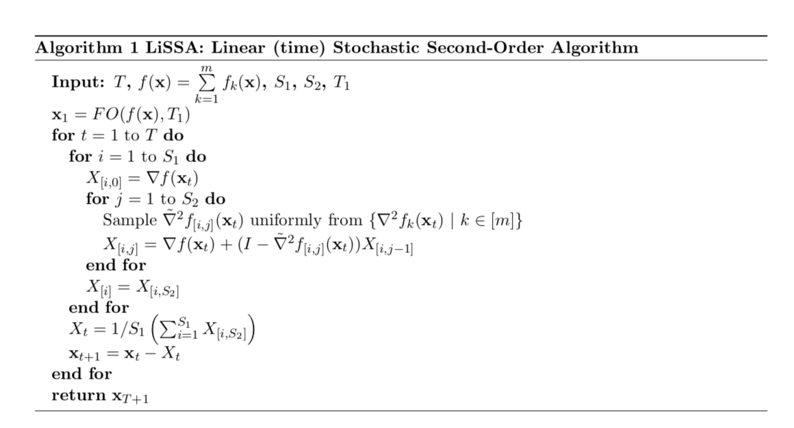
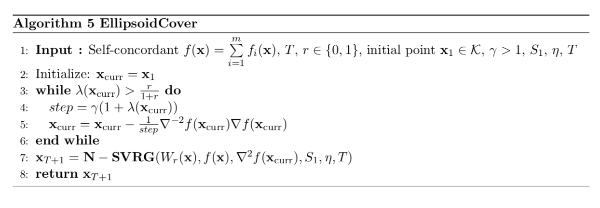
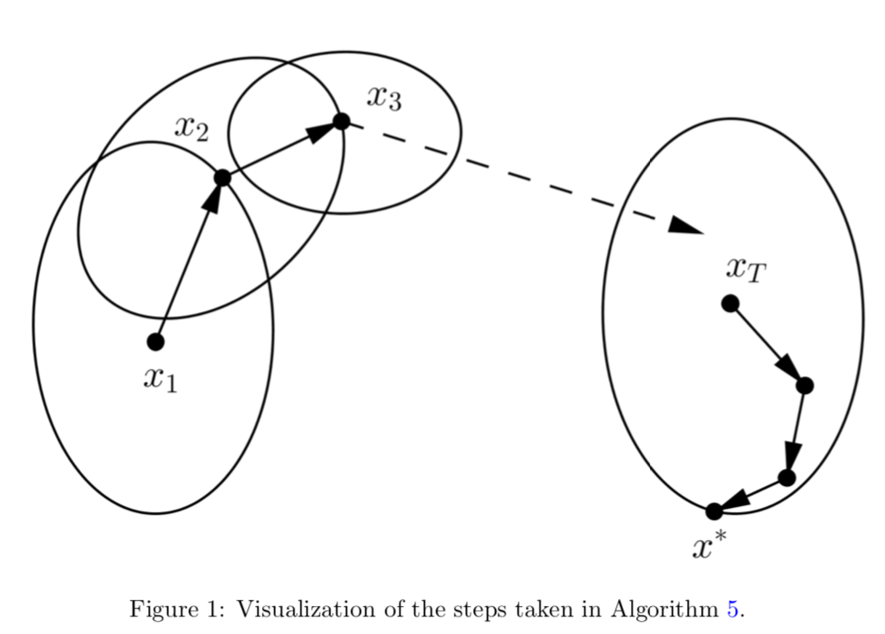
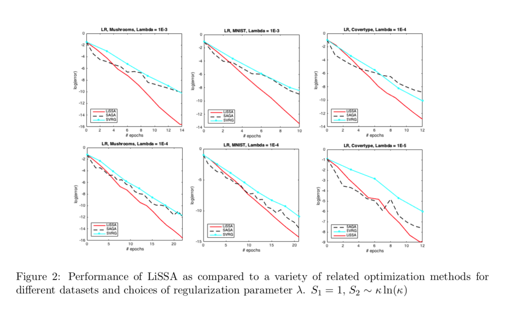
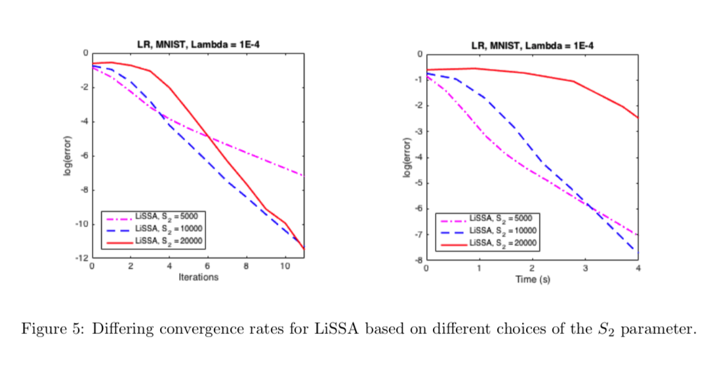

# 机器学习中线性时间的二阶随机优化

## 0. 摘要

一阶随机方法由于每次迭代具有高效的复杂度，是大规模机器学习操作优化的最新方法**state-of-the-art，使用最先进方法的，体现最高水平的**。虽然二阶方法能够提供更快的收敛速度，但由于计算二阶信息的成本较高，人们对其研究较少。在本文中，我们开发了一种二阶随机方法来解决机器学习中的优化问题，这种方法与基于梯度方法的每次迭代的损失**the per-iteration cost of gradient based methods**相匹配，并且在一定的条件下，改进了现有最好方法**state-of-the-art**的总体运行时间。此外，我们的算法在输入数据稀疏的情况下具有良好的线性时间可实现性。

## 1. 介绍

在最近的文献中，随机一阶优化已经成为训练学习模型的主要工作负载**workhorse**，这在很大程度上是因为它每次迭代的(在数据表示上)线性的计算成本是（我们）可以负担的。近年来，主要研究工作致力于提高一阶方法收敛速度，它们引入了很多优雅的思想和算法，包括自适应正则化**adaptive regularization**[DHS11]、方差约简**variance reduction**[JZ13, DBLJ14]、双坐标上升法**dual coordinate ascent**[SSZ13]等等。

相比之下，二阶方法在大规模机器学习(ML)应用中很少被研究，因为它们每次迭代的计算成本非常高，除了矩阵反演**matrix inversion**外，还需要计算黑森矩阵**the Hessian**。这些操作对于高维的大规模问题是不可行的。

在本文中，我们提出了一组新的二阶算法，**LiSSA(线性时间随机二阶算法)**用于凸优化，它可以在保证快速收敛的同时，实现每次迭代（仅）花费线性时间，与最著名的基于梯度的方法的运行时间相匹配（or 一致 **match**）。此外，在训练样本的数目(m)远大于基础维数(d)的情况下，我们证明了我们的算法比最著名的基于梯度的方法具有更快的运行时间。

形式上，我们关注的主要优化问题是经验风险最小化(ERM)问题**the Empirical Risk Minimization (ERM) problem**:

$\min\limits _{\mathbf{x} \in \mathbb{R}^{d}} f(\mathbf{x})=\min\limits _{\mathbf{x} \in \mathbb{R}^{d}}\left\{\frac{1}{m} \sum\limits_{k=1}^{m} f_{k}(\mathbf{x})+R(\mathbf{x})\right\}$

其中每个$f_{k}(\mathbf{x})$是一个凸函数，$R(\mathbf{x})$是一个凸正则化器 **convex regularizer**。上述优化问题是大多数监督学习环境中需要最小化的标准目标函数。例如，逻辑回归**Logistic Regression**、支持向量机**SVM**，等等。ERM在ML中的许多应用的一个共同方面是，损失函数$f_{i}(\mathbf{x})$的形式均为$l\left(\mathbf{x}^{T} \mathbf{v}_{i}, y_{i}\right)$，其中$\left(\mathbf{v}_{i}, y_{i}\right)$是第i个训练样本-标签对**training example-label pair**。我们将这些函数称为广义线性模型**Generalized Linear Models**(GLM)，并将接下来我们关注这种情况。我们要假设正则化器**regularizer**是$\ell_{2}$正则化器（可以放松假设），典型的例子是$\|\mathbf{x}\|^{2}$。

在本文中，我们主要研究二阶优化方法(牛顿法**Newton’s Method**)，其中每次迭代，基本原理是在任意点上移动到二阶泰勒逼近的最小值。在形式上，牛顿法在$\mathbf{x}_{t}$点的更新由

$\mathbf{x}_{t+1}=\mathbf{x}_{t}-\nabla^{-2} f\left(\mathbf{x}_{t}\right) \nabla f\left(\mathbf{x}_{t}\right)\quad\quad\quad\quad\quad\quad\quad\quad (1)$给出。牛顿法几个理想性质：不依赖于坐标系选择，基于当前点曲率Hessian就可以提供必要的正则化。事实上，牛顿方法最终可以实现二次收敛[Nes04]。尽管牛顿法有良好的理论保证，每一步的复杂性的增长大致$\Omega\left(m d^{2}+d^{3}\right)$(前一项用来计算Hessian，后者用来做inversion)，这使其在实践中得不到应用。我们的主要贡献是一套算法，每个算法都基于随机海森信息**stochastic Hessian information**执行近似牛顿法更新**approximate Newton update**，并且在线性**O(d)**时间内可实现。这些算法在理论和实践上都对现有的最好的一阶方法进行了改进。下面我们对我们的结果做一个总结。我们提出了两种算法，**LiSSA**算法和**LiSSA- Sample**算法。

+ **LiSSA: (Algorithm 1)**是一种基于一个新的对Hessian矩阵的逆的**Hessian inverse**估计量，得到一个有效的牛顿步长**Newton Step** (Equation 1)实用的随机二阶算法。这个估计量**estimator**是基于一个广为人知的对逆矩阵**inverse**的**Tylor Approximation** (Fact 2)，我们将在3.1.节中正式描述它。我们证明了关于LiSSA的下列非正式定理。

> ***Theorem (Informal).*** 
>
> LiSSA可以在总时间$\tilde{O}\left(\left(m+S_{1} \kappa\right) d \log \left(\frac{1}{\varepsilon}\right)\right)$，返回一个点$\mathbf{x}_{t}$，使得$f\left(\mathbf{x}_{t}\right) \leq \min _{\mathbf{x}^{*}} f\left(\mathbf{x}^{*}\right)+\varepsilon$。
>
> 其中，$\kappa$是问题的基础条件数**underlying condition number**， $S_{1}$是方差估计量的界**bound**。

上述定理的精确版本记述在 ***定理3.3.*** 中。理论上，我们可以证明$S_1$的最优界**best bound**是$O\left(\kappa^{2}\right)$。但是，在实践中我们观察到将$S_1$设为一个很小的常数就充分了（？）**setting S1 to be a small constant is sufficient**。因此，上述定理表明，与最先进的一阶方法相比，LiSSA具有较高的收敛速度。在第*1.2.* 节中，我们将我们的结果与现有的一阶和二阶方法进行了详细的比较。此外，我们将在**Section 7**中证明，与流行的一阶方法相比，LiSSA在实践中表现得很好。我们还表明LiSSA的运行时间与输入稀疏性**input sparsity**成正比，这使得它成为一种对高维稀疏数据**high dimensional sparse data**有吸引力的方法。

+ **LiSSA-Sample:**  该变量将高效的一阶算法与矩阵采样**Matrix Sampling**技术[LMP13, CLM+15]结合起来，在$m>d$的情况下，它比目前最先进的ML凸优化算法，有更好的运行时间的保证。具体地，我们证明了如下定理:

> ***Theorem (Informal).*** 
>
> LiSSA可以在总时间$\tilde{O}(m+\sqrt{\kappa d}) d \log ^{2}\left(\frac{1}{\varepsilon}\right) \log \log \left(\frac{1}{\varepsilon}\right)$，返回一个点$\mathbf{x}_{t}$，使得$f\left(\mathbf{x}_{t}\right) \leq \min _{\mathbf{x}^{*}} f\left(\mathbf{x}^{*}\right)+\varepsilon$。

在我们设定$\kappa>m>d$时，上述结果通过加速严格地提高了一阶方法最著名的运行时间。

在我们所有的上述结果中，$\kappa$对应于基础问题的条件数**the condition number of the underlying problem** 。特别地，我们假设基本问题有一定的强凸性 **some strong convexity**。这是一个通常通过添加$\ell_{2}$正则化器**$\ell_{2}$ regularizer**来实现的标准假设。在正式地阐述我们的结果中，我们强调条件数的不同概念之间的细微差别(参考Section 2)，并且我们会就这些概念精确地陈述我们的结果。总而言之，我们对条件数的所有泛化**generalization**或者放松**relaxations**，都会小于$\frac{1}{\lambda}$，其中$\lambda$是增加的$\ell_{2}$正则化器的系数，它通常被认为是问题的条件数**the condition number of the problem**。一些文献通过引入近似方法**introducing proximal methods**，使强凸性**strong convexity**条件得到了弱化**relax**。这是一个有趣的方向，我们可以调整我们的结果以适应那些设置，具体工作留到将来。

我们还注意到，我们所有的结果都集中在非常高精度的领域。一般来说，只有在需要相当小的误差时，才能看出线性收敛和二阶方法的优点是有效的。这也是最近在快速一阶方法**fast first-ordermethods**方向取得的一些进展，它们对随机梯度下降的改进效果只在高精度的情况下才变得明显，而我们的实验也表明，二阶方法在非常高精度的情况下优于快速一阶方法。

我们进一步考虑了函数$f$自和谐**self-concordant**的特殊情况。自和谐函数**Self-concordant functions**是凸函数的一个子类**sub-class**，它在内点法 **Interior Point Methods** 背景下的凸优化文献中得到了广泛的研究[Nem04]。对于自和谐函数，我们提出了一种算法***(Algorithm 5)***，它在不依赖于条件数的情况下，以保证的运行时间**with running time guarantees**实现线性收敛。我们在**Theroem 6.2**将证明此算法正式的运行时间保证。

+ 自和谐函数：https://www.cnblogs.com/prototyping/p/10163351.html

我们注意到，尽管我们证明了LISSA-Sample在参数设定恰当的情况下，理论上有最好的运行时间，我们相信我们的主要贡献是表明了的二阶方法具有可比性（对一阶方法），以及它在大数据问题上通常可以比一阶凸优化方法更优，甚至在理论和实践中测量的运行时间的绝对规模上**absolute scale of running time** （都更优）。

### 1.1. Overview of Techniques

+ **LiSSA:** LiSSA的核心思想是利用泰勒展开**Taylor expansion**构造一个对逆**inverse**的自然估计量**natural estimator**。确实，从***Section 3.1.***对估计量的描述中可以看出，随着我们在级数中包含越来越多的项，我们构造的估计量变得无偏。我们注意到，在以前的工作(如[EM15])中考虑的估计量并非如此，因此我们认为我们的估计量更自然。在算法的实现中，我们通过适当地截断序列**truncating the series**来实现最优的偏差-方差权衡**the optimal bias/variance trade-off**。

一个对我们线性时间$O(d)$步长的重要观测是，对GLM函数，$\nabla^{2} f_{i}(\mathbf{x})$是$\alpha \mathbf{v}_{i} \mathbf{v}_{i}^{T}$的形式，其中$\alpha$是一个依赖于$\mathbf{v}_{i}^{T} \mathbf{x}$的标量。LiSSA中的单一步长**a single step**（？？）要求我们有效地对给定的向量$\mathbf{b}$计算$\nabla^{2} f_{i}(\mathbf{x}) \mathbf{b}$。在这个情况下可以发现，矩阵-向量乘积被简化为向量-向量乘积，这给了我们一个$O(d)$时间的更新。

+ **LiSSA-Sample:** LiSSA-Sample基于***Algorithm 2***，这个算法代表了将牛顿方法的二次极小化观点**the quadratic minimization view of Newton’s method**与任何有效的一阶方法相结合**couples**的一般算法族。从本质上讲，牛顿的方法允许我们将一般凸函数的优化(至多是loglog factors)简化为求解中级二次**intermediate quadratic**或岭回归问题**（中级二次问题？？）**。这种简化在以下两方面有效：

首先，正如我们通过LiSSA-Sample算法所展示的，岭回归问题的二次性质允许我们利用强大的抽样技术，从而改进了最著名的一阶加速方法的运行时间。在较高的层次上，这种改进来自于这样一个事实，即当求解d维m个线性方程组时，通过数据的常数次数**（a constant number of passes through data是不是说常数次遍历data？？？）**就足以将方程组简化为$O(d \log (d))$方程。我们仔细地将这一原理和它所需的计算同加速的一阶方法结合起来，以实现LISSA-Sample的运行次数**（times？？）**。二次子问题**quadratic sub-problems**(岭回归)的结果如**Theorem 5.1.**所示，凸优化的结果如**Theorem 5.2.** 所示。

减弱到二次子问题的第二个优点是，中间二次**intermediate quadratic**子问题的条件比函数本身更好**better conditioned**，这使得我们在实际中可以更好地选择步长。我们在**Section 2.** 中正式定义了条件数这些局部概念**local notions**，并在**Theorem 4.1.**中总结了这些算法的典型优点。我们注意到，从理论上讲，这不是一个显著的改进；然而，在实践中，我们认为这可能是非常重要的，并会导致运行时间的改进，正如我们对LiSSA的实验所证明的那样。

为了实现LiSSA-Sample的界**bound**，我们将[CLM+15]中描述的通过杠杆得分**leverage scores**进行抽样的定义和过程扩展到新的情况，其中矩阵是通过对一些PSD矩阵加和而不仅仅是对一个矩阵进行秩 **rank one matrices ？？？**得到的。在此背景下，我们对[CLM+15]中所证明的定理进行了重新表述和证明。这些可能是**independent interest**。

+ **independent interest**：It is not a technical term. We think some people would find theorem X interesting even if they don't care about the particular problem we're using it to solve in this paper. Therefore if you're trying to judge how important our work is, please don't consider only the main problem in the title, but also whichother uses Theorem X might have.

### 1.2. Comparison with Related Work

在本节中，我们的目标是提供一个对大规模ML优化方法的关键思想和结果的简要介绍。我们的主要目的是与最先进的方法比较和对比结果的理论保证我们所知的运行时间。我们将总结归纳为三个高层次的原理:一阶梯度法、二阶黑森法和拟牛顿法。为了简洁起见，我们将我们的总结限制在目标是强凸的情况下的结果，正如上面所证明的，在实践中通常通过添加适当的正则化器来确保这一点。在这种情况下，通常主要关注的是获得具有可证明的线性收敛性和快速实现的算法。

+ **First Order Methods:** 一阶方法在ML优化算法中占据了主导地位，这主要是因为它们的实现时间总是可以与维数**dimension** (或稀疏度**sparsity**)成比例。众所周知，一般的梯度下降法**Vanilla gradient descent**是线性收敛到最优解的，其收敛速度与目标的条件数成反比。在大数据环境中，随机一阶方法(在[RM51]中首先引入和分析)被证明是特别成功的。然而，即使在强凸的情况下，一般SGD**Vanilla SGD**也是亚线性收敛的**sub-linearly**。最近，有人巧妙地将随机梯度下降法与完整版本的梯度下降法融合以提供方差减少**variance reduction**，这让一阶方法在运行时间方面取得了重大进展。该领域的代表性算法有**SAGA** [RSB12, DBLJ14]和**SVRG** [JZ13, ZMJ13]。上述算法的关键技术成就是放松运行时间对m(训练例子的数量)的依赖性和$\kappa$(条件数)从乘积变成求和**（？？）**。另一种能达到类似运行时间保证的算法是基于双坐标上升的，**SDCA** [SSZ13]。

对SAGA、SDCA和SVRG的进一步改进是通过应用Nesterov [Nes83]开创性工作中提出的经典加速***acceleration***概念而实现的。这里的工作进展包括SDCA [SSZ16]的加速版本，Catalyst [LMH15]提供了一个通用的框架来加速一阶算法，还有Katyusha [Zhu16]引入了负动量**negative momentum**的概念来扩展加速度，使方差减少的算法**variance reduced algorithms**超越强凸设置。一般加速方法的关键技术成果是将对条件数的依赖性从线性降低到平方根。我们在**Table 1.** 中总结了这些结果。

通过可以与**SAGA / SVRG**(参考**Table 1.**)相比的运行时间依赖性，LiSSA自然地把自身和一些快速一阶方法放到了一起。在LiSSA-Sample中，我们利用在文献中已经开发和利用的有效的抽样技术来处理的的子问题的二次结构，在当基础维数**underlying dimension**远小于训练实例的数量使用加速的一阶方法改善运行时间。事实上，就我们所知，LiSSA-Sample是m >> d条件下已知的最快的(理论上)算法。这种改进对于目前的一阶方法来说似乎是无法控制的（or 无法是做到的，**out of hand**），因为它似乎强有力地利用了子问题的二次性质来减小其大小。我们在**Table 1.** 中总结了这些结果。

+ **Second Order Methods: **二阶方法，如牛顿法，经典地用于许多不同的优化设置，包括开发用于一般凸规划的内点方法**Interior Point Methods**[Nem04]。牛顿法的主要优点是算法的线性二次收敛速度**the linear-quadratic convergence rate**。然而，如果简单粗暴地使用牛顿方法，则会出现两个重要问题，即标准分析需要进行完整的Hessian计算，这将花费$O\left(m d^{2}\right)$，这种耗费不适用于ML，而矩阵求逆**matrix inversion**通常需要$O\left(d^{3}\right)$时间。这些问题最近在NewSamp [EM15]的工作中得到了解决，该工作通过子抽样**subsampling**处理了第一个问题，并通过低秩投影**low rank projections**处理了第二个问题。我们对[EM15]进行了改进，为黑塞矩阵的逆**Hessian inverse**定义了一个更自然的估计量，并证明了该估计量可以按与$O\left(d^{}\right)$成比例的时间计算。我们还向读者介绍了[Mar10, BCNN11]的工作，其中包含了对黑塞矩阵采样**taking samples of the Hessian**的想法；然而，这些工作并没有为他们提出的基于问题的特定参数的算法提供精确的运行时间保证。

+ **Quasi-Newton Methods: 拟牛顿法** 通过从梯度变化中对曲率的估计，牛顿步长计算量大的问题也得到了解决。这些算法通常被称为准牛顿法，源于开创性的**BFGS**算法[Bro70, Fle70, Gol70, Sha70]。我们想向读者推荐一本书[NW06]，这本书对该算法及其有限内存变体**limited memory variant (L-BFGS)**有很好的参考价值。该领域最近的工作集中于分析随机拟牛顿方法**Stochastic Quasi-Newton methods**，这些方法是由[SYG07, MR14, BHNS14]提出并在不同的环境下分析的。这些工作通常实现次线性收敛**sub-linear convergence**到最优。在这方面，[MNJ16]提出了一种基于**L-BFGS**的算法，该算法融合了方差约简**variance reduction**的思想，来得到在强凸性条件下线性收敛到最优。虽然算法实现了线性收敛，但是算法的运行时间对条件数的依赖性很差(作者也承认了)。实际上，在我们感兴趣的实际应用中，条件数并不一定是一个常数**the condition number is not necessarily a constant**，这与[MNJ16]中的理论结果通常假定的情况不同。

我们对ML应用中的黑塞矩阵和向量乘积的计算**Hessian-vector products**的线性时间的关键观察表明了，在这种情况下，获得真实的海森信息就足够有效，因而可以通过梯度减弱对拟牛顿信息的需要**Quasi-Newton information**。

### 1.3. Organization of the Paper

本文组织如下。在**Section 2**中，我们首先提出必要的定义，符号和约定**conventions**。在**Section 3**中，我们描述了我们对LiSSA的估计量，并对LiSSA的收敛性保证进行了证明。在Section 4中，在我们给出了一个一阶方法与牛顿方法耦合**couple**的一般化程序**generic procedure**之后，我们在**Section 5**给出了LiSSA-Sample和相关的快速二次求解器**fast quadratic solver**。然后，我们在**Section 6**中给出了关于自和谐函数**self-concordant functions**的结果。最后在**Section 7**中对LiSSA进行了实验评估。

## 2. Preliminaries

我们约定用小写表示向量和标量，用大写表示矩阵，用黑体表示向量。我们将使用不带下标的$\|\cdot\|$来表示向量的$\ell_{2}$范数和矩阵的谱范数**the spectral norm**。在整个论文我们表示$\mathbf{x}^{*} \triangleq \operatorname{argmin}_{\mathbf{x} \in \mathcal{K}} f(\mathbf{x})$。我们定义一个凸函数是$\alpha$ -strongly convex 和 $\beta$ -smooth的，如果$\forall \mathbf{x}, \mathbf{y}$，

$\nabla f(\mathbf{x})^{\top}(\mathbf{y}-\mathbf{x})+\frac{\beta}{2}\|\mathbf{y}-\mathbf{x}\|^{2} \geq f(\mathbf{y})-f(\mathbf{x}) \geq \nabla f(\mathbf{x})^{\top}(\mathbf{y}-\mathbf{x})+\frac{\alpha}{2}\|\mathbf{y}-\mathbf{x}\|^{2}$

下式是一个关于矩阵A的逆的广为人知的结果，使得$\|A\| \leq 1$ and $A \succeq 0 :$

$A^{-1}=\sum\limits_{i=0}^{\infty}(I-A)^{i}\quad\quad\quad\quad\quad\quad\quad(2)$

+ 谱范数：https://zhuanlan.zhihu.com/p/30674132

> **Definition of Condition Numbers 条件数的定义 :** 现在，我们为函数$f$的条件数定义几种度量方法。这些概念之间的区别是细微的，我们使用它们来精确地描述我们算法的运行时间。
>
> 对于一个$\alpha$ -strongly convex and $\beta$ -smooth的函数$f$，这个函数的条件数被定义为$\kappa(f) \triangleq \frac{\beta}{\alpha}$，或者函数在上下文中是清晰明确的时定义为$\kappa$。注意到这与下面的概念（or 定义）相对应
>
> $\kappa \triangleq \frac{\max _{x} \lambda_{\max }\left(\nabla^{2} f\right)}{\min _{x} \lambda_{\min }\left(\nabla^{2} f\right)}$
>
> 我们定义了一个稍微宽松的条件数的概念，其中*max*移出了上面的分式。我们将这一概念称为局部条件数 **a local condition number**$\kappa_l$以和上面定义的全局条件数**the global condition number**$\kappa$对比。由此可见，$\kappa_l \leq \kappa$
>
> $\kappa_{l} \triangleq \max\limits _{\mathbf{x}} \frac{\lambda_{\max }\left(\nabla^{2} f(\mathbf{x})\right)}{\lambda_{\min }\left(\nabla^{2} f(\mathbf{x})\right)}$
>
> 上面的记号对任意的一般函数$f$都可以定义，但是对函数形式如$f(\mathbf{x})=\frac{1}{m} \sum\limits_{k=1}^{m} f_{k}(\mathbf{x})$的ERM函数，􏰑要对组成函数**component functions**进行进一步的区分。我们用$\hat{\kappa}$来定义条件数。在这种情况下，通常假定每个组成部分$\beta_{\max }(\mathbf{x}) \triangleq \max\limits _{k} \lambda_{\max }\left(\nabla^{2} f_{k}(\mathbf{x})\right)$都有以下界限**bound**。**SVRG**等算法的运行时间取决于下面这个条件数的概念
>
> $\hat{\kappa}=\frac{\max _{\mathbf{x}} \beta_{\max }(\mathbf{x})}{\min _{\mathbf{x}} \lambda_{\min }\left(\nabla^{2} f(\mathbf{x})\right)}$
>
> 类似地，我们给$\hat{\kappa}$定义了一个局部条件数**local condition number**的概念,即
>
> $\hat{\kappa}_{l} \triangleq \max _{\mathbf{x}} \frac{\beta_{\max }(\mathbf{x})}{\lambda_{\min }\left(\nabla^{2} f(\mathbf{x})\right)}$
>
> 像以前一样，我们可以立即得到$\hat{\kappa}_l \leq \hat{\kappa}$

对我们 (诚然悲观) 的方差界限**bounds**，我们每个组成部分也需要一个强大的凸性界限约束$\alpha_{\min }(\mathbf{x}) \triangleq \min\limits_{k} \lambda_{\min }\left(\nabla^{2} f_{k}(\mathbf{x})\right)$。现在我们可以定义

$\hat{\kappa}_{l}^{\max } \triangleq \max\limits _{\mathbf{x}} \frac{\beta_{\max }(\mathbf{x})}{\alpha_{\min }(\mathbf{x})}$

> ***Assumptions:*** 根据前面的定义，为了使分析更简单，我们对给定函数$f=\frac{1}{m} \sum\limits_{k=1}^{m} f_{k}(\mathbf{x})$做了如下假设。首先，我们假设正则化项被平均分配并包含在$f_{k}$中。我们进一步假设每个$\nabla^{2}\left(f_{k}\right) \preceq I$。我们还假设$f$ 是 $\alpha$ -strongly convex and $\beta$ -smooth，$\hat{\kappa}_{l}$是相关的局部条件数，$\nabla^{2} f$是以$M$为界的李普西斯常数**Lipschitz constant**。

现在，我们收集了一些关键概念和已有的结果，以便在本文的其余部分中进行分析。

> ***Matrix Concentration:*** 下面的引理是独立矩阵的和的测量结果的标准浓度**？？？The following lemma is a standard concentration of measure result for sums of independent matrices** 。这个材料的一个很好的参考文献是[Tro12]。

> ***Theorem 2.1 (Matrix Bernstein [Tro12]).***
>
> 考虑一列独立的、随机的、具有d维Hermitian矩阵的**Hermitian matrices**有限序列$\left\{X_{k}\right\}$。假设$\mathbf{E}\left[X_{k}\right]=0$ and $\left\|X_{k}\right\| \leq R$，定义$Y=\sum_{k} X_{k}$，那么我们有$\forall\ t \geq 0$，$\operatorname{Pr}(\|Y\| \geq t) \leq d \exp \left(\frac{-t^{2}}{4 R^{2}}\right)$

> ***Accelerated SVRG*** 下面的定理在 [LMH15]中有证明.

> ***Theorem 2.2.*** 给定一个具有条件数$\kappa$的函数$f(\mathbf{x})=\operatorname{\sum}_{i=1}^{m} f_{i}(\mathbf{x})$，通过Catalyst [LMH15]的SVRG的加速版本以概率$1-\delta$在时间$\tilde{O}(m d+\min (\sqrt{\kappa m}, \kappa) d) \log \left(\frac{1}{\varepsilon}\right)$内，找到一个$\varepsilon$近似的极小值点。

+ ？？？为什么这个地方f没有除以m

> ***Sherman-Morrison Formula*** 下面是一个众所周知的表达式，它表示矩阵增加一个秩为1的微扰之后的逆
>
> $\left(A+\mathbf{v} \mathbf{v}^{T}\right)^{-1}=A^{-1}-\frac{A^{-1} \mathbf{v} \mathbf{v}^{T} A^{-1}}{1+\mathbf{v}^{T} A^{-1} \mathbf{v}}$

## 3. LiSSA: Linear (time) Stochastic Second-Order Algorithm

### 3.1 Estimators for the Hessian Inverse

基于泰勒展开式(***Equation 2***)的迭代公式，我们现在描述一个海森矩阵的无偏估计量。对于矩阵$A$，将 $A_{j}^{-1}$定义为第$j$项泰勒展开，即

$A_{j}^{-1}=\sum_{i=0}^{j}(I-A)^{i}$ 或等价地有 $A_{j}^{-1}=I+(I-A) A_{j-1}^{-1}$。

注意到  $\lim\limits_{j \rightarrow \infty} A_{j}^{-1} \rightarrow A^{-1} .$ 使用上述的迭代公式，我们现在可以通过 $\tilde{\nabla}^{-2} f_{j}$ 是 $\nabla^{-2} f_{f}$的无偏估计量，进一步得到 $\nabla^{-2} f$ 的无偏估计量。

> ***Definition 3.1 (Estimator).***
>
> 给定Hessian矩阵$\nabla^{2} f$的$j$个独立且无偏的抽样样本$\left\{X_{1} \ldots X_{j}\right\}$，迭代地按如下公式定义$\left\{\tilde{\nabla}^{-2} f_{0} \ldots \tilde{\nabla}^{-2} f_{j}\right\}$
>
> $\tilde{\nabla}^{-2} f_{0}=I$ 且 $\tilde{\nabla}^{-2} f_{t}=I+\left(I-X_{j}\right) \tilde{\nabla}^{-2} f_{t-1}$。

> ***Remark 3.2.*** 我们还可以根据***Equation (2)***中的直接抽样项来定义和分析一个更简单的(非递归的)估计量。理论上可以得到类似的估计量保证；然而，根据实践经验，我们提出的估计量在性能上是优越的。

### 3.2. Algorithm

在本节中，我们描述了我们的主要算法LiSSA(***Algorithm 1***)，我们的算法分为两个阶段：第一阶段，它对$T_{1}$步运行任何有效的一阶**FO**方法，将函数值缩小到我们的算法可以得到线性收敛的状态。它进一步使用***Definition 3.1***中定义的估计量来代替真正的Hessian矩阵的逆来执行牛顿步长**Newton steps**。我们用两个参数$S_{1}, S_{2}$，来定义牛顿步长**Newton steps**。$S_{2}$表示我们获取泰勒展开的深度。$S_{1}$表示无偏估计量的数目，我们通过取平均得到更好的Hessian矩阵的逆。在该算法中，我们直接计算平均牛顿步长**average Newton step**，它可以像之前所观察到的那样在线性时间内计算，而不需要估计Hessian矩阵的逆。

### 3.3. Main Theorem

在本节中，我们给出了分析**LiSSA**的收敛性的主要定理。定义$F O\left(M, \hat{\kappa}_{l}\right)$是一阶算法要达到准确度$\frac{1}{4 \hat{\kappa}_{l} M}$所需要的总时间。

> ***Theorem 3.3.***
>
> 考虑***Algorithm 1*** ，设置参数：$T_{1}=F O\left(M, \hat{\kappa}_{l}\right), S_{1}=O\left(\left(\hat{\kappa}_{l}^{\max }\right)^{2} \ln \left(\frac{d}{\delta}\right)\right)$，$S_{2} \geq 2 \hat{\kappa}_{l} \ln \left(4 \hat{\kappa}_{l}\right)$。对$\forall \ $$t \geq T_{1}$，以概率$1-\delta$，下面的保证**guarantee**成立，$\left\|\mathbf{x}_{t+1}-\mathbf{x}^{*}\right\| \leq \frac{\left\|\mathbf{x}_{t}-\mathbf{x}^{*}\right\|}{2}$。
>
> 此外，我们这个算法的每一步最多消耗$\tilde{O}\left(m d+\left(\hat{\kappa}_{l}^{\max }\right)^{2} \hat{\kappa}_{l} d^{2}\right)$时间。进一步地，如果$f$是$GLM$，那么这个算法的每一步可以在时间$O\left(m d+\left(\hat{\kappa}_{l}^{\max }\right)^{2} \hat{\kappa}_{l} d\right)$内完成。

那我们马上得到下面的推论。

> ***Corollary 3.4.*** 对于一个$GLM$函数$f(x)$，Algorithm 1可以以不小于$1-\delta$的概率，最终返回点$\mathbf{x}_{t}$，其满足$f\left(\mathbf{x}_{t}\right) \leq \min _{\mathbf{x}^{*}} f\left(\mathbf{x}^{*}\right)+\varepsilon$，且总时间$\tilde{O}\left(m+\left(\hat{\kappa}_{l}^{\max }\right)^{2} \hat{\kappa}_{l}\right) d \ln \left(\frac{1}{\varepsilon}\right)$ for $\varepsilon \rightarrow 0$。

在上面的定理中，$\tilde{O}$隐藏了$\kappa, d, \frac{1}{\delta}$的**log factors？？**。我们注意到我们给方差的界限$\left(\hat{\kappa}_{l}^{\max }\right)^{2}$是非常悲观的，它可以改进为一个更平均的量。然而，由于它在实践中没有多大的效果，我们没有试图进一步优化它。

现在我们证明我们的主要定理——关于LiSSA定理3.3收敛性。

***Proof of Theorem 3.3.*** 

注意到我们使用一阶算法得到了准确度至少为$\frac{1}{4 \hat{\kappa}_{l} M}$的解，也就是有$\left\|\mathbf{x}_{1}-\mathbf{x}^{*}\right\| \leq \frac{1}{4 \hat{\kappa}_{l} M}$。

从***Definition 3.1***中可以直接看出，我们算法的单一步长**a single step**（步骤？）等价于$\mathbf{x}_{t+1}=\mathbf{x}_{t}-\tilde{\nabla}^{-2} f\left(\mathbf{x}_{t}\right) \nabla f\left(\mathbf{x}_{t}\right)$，其中$\tilde{\nabla}^{-2} f\left(\mathbf{x}_{t}\right)$是$S_{1}$个独立估计量$\tilde{\nabla}^{-2} f\left(\mathbf{x}_{t}\right) S_{2}$的平均值。我们利用下面的这个Lemma。

> ***Lemma 3.5.*** 定义$\mathbf{x}_{t+1}=\mathbf{x}_{t}-\tilde{\nabla}^{-2} f\left(\mathbf{x}_{t}\right) \nabla f\left(\mathbf{x}_{t}\right)$，作为***Algorithm 1***中每一个迭代，$S_{1}, S_{2}$也同***Algorithm 1***的定义。之后，如果我们选择$S_{2} \geq 2 \hat{\kappa}_{l} \ln \left(2 \hat{\kappa}_{l}\right)$，我们可以对每一步以概率$1-\delta$得到下面的收敛性保证，
>
> $\left\|\mathbf{x}_{t+1}-\mathbf{x}^{*}\right\| \leq \gamma\left\|\mathbf{x}_{t}-\mathbf{x}^{*}\right\|+M\left\|\nabla^{-2} f\left(\mathbf{x}_{t}\right)\right\|\left\|\mathbf{x}_{t}-\mathbf{x}^{*}\right\|^{2}$
>
> 其中，$\gamma=16 \hat{\kappa}_{l}^{\max } \sqrt{\frac{\ln \left(d \delta^{-1}\right)}{S_{1}}}+\frac{1}{16}$。

代入$S_{1}, S_{2}$的值，将**Equation (3)** 和**Lemma 3.5**组合起来，并且注意到$\left\|\nabla^{-2} f\left(\mathbf{x}_{t}\right)\right\| \leq \hat{\kappa}_{l}$，我们有在Newton法开始时，$\left\|\mathbf{x}_{t+1}-\mathbf{x}^{*}\right\| \leq \frac{\left\|\mathbf{x}_{t}-\mathbf{x}^{*}\right\|}{4}+M \hat{\kappa}_{l}^{\max }\left\|\mathbf{x}_{t}-\mathbf{x}^{*}\right\|^{2} \leq \frac{\left\|\mathbf{x}_{t}-\mathbf{x}^{*}\right\|}{2}$成立。

通过归纳可以看出，上述性质适用于所有$t \geq T_{1}$，证明的结论都成立。

我们下面证明***Lemma 3.5***。

定义$\chi\left(\mathbf{x}_{t}\right)=\int_{0}^{1} \nabla^{2} f\left(\mathbf{x}^{*}+\tau\left(\mathbf{x}_{t}-\mathbf{x}^{*}\right)\right) d \tau$。注意到$\nabla f\left(\mathbf{x}_{t}\right)=\chi\left(\mathbf{x}_{t}\right)\left(\mathbf{x}_{t}-\mathbf{x}^{*}\right)$。下面的分析与Nesterov [Nes04]中类似，我们有

$\begin{aligned}\left\|\mathbf{x}_{t+1}-\mathbf{x}^{*}\right\| &=\left\|\mathbf{x}_{t}-\mathbf{x}^{*}-\tilde{\nabla}^{-2} f\left(\mathbf{x}_{t}\right) \nabla f\left(\mathbf{x}_{t}\right)\right\| \\ &=\left\|\mathbf{x}_{t}-\mathbf{x}^{*}-\tilde{\nabla}^{-2} f\left(\mathbf{x}_{t}\right) \chi\left(\mathbf{x}_{t}\right)\left(\mathbf{x}_{t}-\mathbf{x}^{*}\right) d \tau\right\| \\ & \leq\left\|I-\tilde{\nabla}^{-2} f\left(\mathbf{x}_{t}\right) \chi\left(\mathbf{x}_{t}\right)\right\|\left\|\mathbf{x}_{t}-\mathbf{x}^{*}\right\| \end{aligned}$

继而有

$\frac{\left\|\mathbf{x}_{t+1}-\mathbf{x}^{*}\right\|}{\left\|\mathbf{x}_{t}-\mathbf{x}^{*}\right\|} \leq\left\|I-\tilde{\nabla}^{-2} f\left(\mathbf{x}_{t}\right) \chi\left(\mathbf{x}_{t}\right)\right\|=\left\|\underbrace{I-\nabla^{-2} f\left(\mathbf{x}_{t}\right) \chi\left(\mathbf{x}_{t}\right)}_{a}-\underbrace{\left(\tilde{\nabla}^{-2} f\left(\mathbf{x}_{t}\right)-\nabla^{-2} f\left(\mathbf{x}_{t}\right)\right) \chi\left(\mathbf{x}_{t}\right)}_{b}\right\|$

我们现在分别分析a，b两项，

$\begin{aligned}\|a\| &=\left\|I-\nabla^{-2} f\left(\mathbf{x}_{t}\right) \chi\left(\mathbf{x}_{t}\right)\right\| \\ & \leq\left\|\nabla^{-2} f\left(\mathbf{x}_{t}\right) \int_{0}^{1} \nabla^{2} f\left(\mathbf{x}_{t}\right)-\nabla^{2} f\left(\mathbf{x}^{*}+\tau\left(\mathbf{x}_{t}-\mathbf{x}^{*}\right)\right) d \tau\right\| \\ & \leq M\left\|\nabla^{-2} f\left(\mathbf{x}_{t}\right)\right\|\left\|\mathbf{x}_{t}-\mathbf{x}^{*}\right\| \end{aligned}$

+ 第一个不等号是不是有问题了？

第二个不等号是从Hessian矩阵的Lipschitz界中得到的。

第二项可以从下式得到其界

$\|b\|=\left(\left\|\left(\tilde{\nabla}^{-2} f\left(\mathbf{x}_{t}\right)-\nabla^{-2} f(\mathbf{x})\right)\right\|\left\|\chi\left(\mathbf{x}_{t}\right)\right\|\right) \leq \gamma$

这一结果是从**Lemma 3.6**中得到的，该引理表明了采样的估计量有一个**a concentration bound？？？**，并且通过我们对函数的假设，我们可以得到$\forall\ \mathbf{x}\left\|\nabla^{2} f(\mathbf{x})\right\| \leq 1$，进而有$\|\chi(\mathbf{x})\| \leq 1$。

把上述两个界限放在一起，并且利用三角不等式，我们可以得到$\frac{\left\|\mathbf{x}_{t+1}-\mathbf{x}^{*}\right\|}{\left\|\mathbf{x}_{t}-\mathbf{x}^{*}\right\|} \leq M\left\|\nabla^{-2} f\left(\mathbf{x}_{t}\right)\right\|\left\|\mathbf{x}_{t}-\mathbf{x}^{*}\right\|+\gamma$，从而完成了***Theorem 3.3***的证明。

> ***Lemma 3.6.*** 令$\tilde{\nabla}^{-2} f\left(\mathbf{x}_{t}\right)$是定义在***3.1***中的$\tilde{\nabla}^{-2} f\left(\mathbf{x}_{t}\right)_{S_{2}}$的$S_{1}$个独立采样的平均数，并且应用在***Algorithm 1***的每一步更新中。令$\nabla^{2} f\left(\mathbf{x}_{t}\right)$是真正的Hessian。如果我们设$S_{2} \geq 2 \hat{\kappa}_{l} \ln \left(\hat{\kappa}_{l} S_{1}\right)$，那么之后有
>
> $\operatorname{Pr}\left(\left\|\tilde{\nabla}^{-2} f\left(\mathbf{x}_{t}\right)-\nabla^{-2} f\left(\mathbf{x}_{t}\right)\right\|>16 \hat{\kappa}_{l}^{\max } \sqrt{\frac{\ln \left(\frac{d}{\delta}\right)}{S_{1}}}+1 / 16\right) \leq \delta$

***Proof of Lemma 3.6.*** 首先，我们注意到下面这个等式就是我们建立的估计量表达式的直接应用

$\mathbf{E}\left[\tilde{\nabla}^{-2} f_{i}\left(\mathbf{x}_{t}\right)\right]=\mathbf{E}\left[\tilde{\nabla}^{-2} f_{i}\left(\mathbf{x}_{t}\right)_{S_{2}}\right]=\sum\limits_{i=1}^{S_{2}}\left(I-\nabla^{2} f\left(\mathbf{x}_{t}\right)\right)^{i}$

从***Equation 2***中我们得知，对于$\|X\| \leq 1$的矩阵$X$，有$X^{-1}=\sum\limits_{i=0}^{\infty}(I-X)^{i}$

因此，我们可以放大方程的倍数**scaled the function**，使得$\left\|\nabla^{2} f_{k}\right\| \leq 1$，那么有

$\nabla^{-2} f\left(\mathbf{x}_{t}\right)=\mathbf{E}\left[\tilde{\nabla}^{-2} f_{i}\left(\mathbf{x}_{t}\right)\right]+\sum\limits_{i=S_{2}}^{\infty}\left(I-\nabla^{2} f\left(\mathbf{x}_{t}\right)\right)^{i} \quad\quad\quad\quad\quad\quad\quad\quad\quad (4)$

还注意到我们有$\nabla^{2} f\left(\mathbf{x}_{t}\right) \succeq \frac{I}{\hat{\kappa}_{l}}$，这表示$\left\|I-\nabla^{2} f\left(\mathbf{x}_{t}\right)\right\| \leq 1-\frac{1}{\hat{\kappa}_{l}}$。从上个等式的第二项中可以推出

$\begin{aligned}\left\|\sum_{i=S_{2}}^{\infty}\left(I-\nabla^{2} f\left(\mathbf{x}_{t}\right)\right)^{i}\right\| & \leq\left\|\left(I-\nabla^{2} f\left(\mathbf{x}_{t}\right)\right)\right\|^{S_{2}}\left(\sum_{i=0}^{\infty}\left\|I-\nabla^{2} f\left(\mathbf{x}_{t}\right)\right\|^{i}\right) \\ & \leq\left(1-\frac{1}{\hat{\kappa}_{l}}\right)^{S_{2}}\left(\sum_{i=0}^{\infty}\left(1-\frac{1}{\hat{\kappa}_{l}}\right)^{i}\right) \\ & \leq\left(1-\frac{1}{\hat{\kappa}_{l}}\right)^{S_{2} }\hat{\kappa}_{l} \\ & \leq \exp \left(-\frac{S_{2}}{\hat{\kappa}_{l}}\right) \hat{\kappa}_{l} \end{aligned}$

又因为我们选择$S_{2} \geq 2 \hat{\kappa}_{l} \ln \left(4 \hat{\kappa}_{l}\right)$，从而我们可以得到上面的结果以1$/ 16$为界 **is bounded by 1/16？？？这个地方好像不准确**。我们现在要使用 ***Matrix Bernstein inequality 2.1***来证明估计值$\tilde{\nabla}^{-2} f$在他的期望附近。为了应用这个不等式，我们首先要限制每个随机变量的谱范数**spectral norm**有界。为此，我们注意到$\tilde{\nabla}^{-2} f_{S_{2}}$有以$\left\|\tilde{\nabla}^{-2} f_{S_{2}}\right\| \leq \sum\limits_{i=0}^{S_{2}}\left(1-1 / \hat{\kappa}_{l}^{\max }\right)^{i} \leq \hat{\kappa}_{l}^{\max }$为界的最大谱范数。我们现在可以应用 ***Matrix Bernstein inequality 2.1***，从而得到

$\operatorname{Pr}\left(\left\|\tilde{\nabla}^{-2} f-\mathbf{E}\left[\tilde{\nabla}^{-2} f\right]\right\|>\varepsilon\right) \leq 2 d \exp \left(\frac{-\varepsilon^{2} S_{1}}{64\left(\hat{\kappa}_{l}^{\max }\right)^{2}}\right)$

设定$\varepsilon=16 \hat{\kappa}_{l}^{\max } \sqrt{\frac{\ln \left(\frac{d}{\delta}\right)}{S_{1}}}$能让我们上述等式的界限是$\delta$。现在把这个界限**bounds**和**Equation (4)** 放在一起，我们可以得到所需的结果。

### 3.4. Leveraging Sparsity 利用稀疏性

真实数据集的一个重要性质是，尽管输入是一个高维向量，但他的非零元素**non-zero entries**的数量通常很少。（也就是很稀疏，很多都是0）下面的定理表明，LiSSA可以以利用数据基本稀疏性**the underlying sparsity？？**的方式实现。我们的关键观察是，对于GLM函数，秩为1的Hessian-vector乘积可以在$O(s)$时间内执行，其中$s$是输入$\mathbf{x}_{k}$的稀疏性**sparsity**。

> ***Theorem 3.7.***
>
> 对于GLM函数，***Algorithm 1***可以返回一个点$\mathbf{x}_{t}$，其满足以至少$1-\delta$的概率，
>
> $f\left(\mathbf{x}_{t}\right) \leq \min _{\mathbf{x}^{*}} f\left(\mathbf{x}^{*}\right)+\varepsilon$
>
> 成立，且总时间$\tilde{O}\left(m s+\left(\hat{\kappa}_{l}^{\max }\right)^{2} \hat{\kappa}_{l} s\right) \ln \left(\frac{1}{\varepsilon}\right)$ for $\varepsilon \rightarrow 0$。

我们要先证明下面的定理，之后***Theorem 3.7.***就很快得证了。

> ***Theorem 3.8.***
>
> 考虑***Algorithm 1***，令函数$f$是之前讨论过的形式，令$s$是$\mathbf{x}_{i}$中非零元素个数的上界。那么算法的每一步都可以在时间$O\left(m s+\left(\kappa_{l}^{\max }\right)^{2} \kappa_{l} s\right)$内执行。

***Proof of Theorem 3.8.*** 用归纳法证明。

令$c_{0}=1, \mathbf{v}_{0}=\mathbf{0}$，并且考虑更新规则$c_{j+1}=1+(1-\lambda) c_{j}$ 和$\mathbf{v}_{j+1}=(1-\lambda) \mathbf{v}_{j}-\tilde{\nabla}^{2} f_{[i, j+1]}(\mathbf{x})\left(c_{j} \nabla f(\mathbf{x})+\mathbf{v}_{j}\right)$，其中$\lambda$是正则化参数。对于基础情况，注意到$X_{[i, 0]}=c_{0} \nabla f(\mathbf{x})+\mathbf{v}_{0}=\nabla f(\mathbf{x})$，正如***Algorithm 1***的所言。进一步，假设$X_{[i, j]}=c_{j} \nabla f(\mathbf{x})+\mathbf{v}_{j}$。那么我们可以得到

$\begin{aligned} X_{[i, j+1]} &=\nabla f(\mathbf{x})+\left(I-\lambda I-\tilde{\nabla}^{2} f_{[i, j+1]}(\mathbf{x})\right) X_{[i, j]} \\ &=\nabla f(\mathbf{x})+\left((1-\lambda) I-\tilde{\nabla}^{2} f_{[i, j+1]}(\mathbf{x})\right)\left(c_{j} \nabla f(\mathbf{x})+\mathbf{v}_{j}\right) \\ &=\left(1+(1-\lambda) c_{j}\right) \nabla f(\mathbf{x})+(1-\lambda)\left(\mathbf{v}_{j}\right)-\tilde{\nabla}^{2} f_{[i, j+1]}(\mathbf{x})\left(c_{j} \nabla f(\mathbf{x})+\mathbf{v}_{j}\right) \\ &=c_{j+1} \nabla f(\mathbf{x})+\mathbf{v}_{j+1} \end{aligned}$

注意到更新$c_{j+1}$需要常数时间**constant time**，并且$\tilde{\nabla}^{2} f_{[i, j+1]}(\mathbf{x})\left(c_{j} \nabla f(\mathbf{x})\right)$ 和$\tilde{\nabla}^{2} f_{[i, j+1]}(\mathbf{x}) \mathbf{v}_{j}$每一个都可以在$O(s)$时间内计算完。我们还可以从中知道，每一次乘积**product**都会给出一个s-稀疏的向量**s-sparse vector**，因此从$(1-\lambda)\left(\mathbf{v}_{j}\right)$中减去它们会消耗$O(s)$时间。因此，更新$\mathbf{v}_{j+1}$的总时间是$O(s)$。因为$\nabla f(\mathbf{x})$可以在$O(m s)$时间内计算完，又因为$\mathbf{v}_{0}$是0-稀疏的（$\mathbf{v}_{j}$中的非零元素最多有$js$个），可以得出计算$X_{t}$需要的总时间是$O\left(m s+\left(\kappa_{l}^{\max }\right)^{2} \kappa_{l} s\right)$。

## 4. LiSSA: Extensions

在本节中，我们首先描述了一组算法，它们通常将一阶方法与二阶方法耦合为子例程**sub-routines**。特别地，我们正式地描述了算法**LiSSA- Quad(Algorithm 2)**，并提供了它的运行时间保证**runtime guarantee**(**Theorem 4.1**)。该算法的核心思想是，牛顿法本质上将一个凸优化问题简化为求解二阶泰勒逼近给出的点$Q_{t}$的中间二次子问题**intermediate quadratic subproblems**

$Q_{t}(\mathbf{y})=f\left(\mathbf{x}_{t-1}\right)+\nabla f\left(\mathbf{x}_{t-1}\right)^{T} \mathbf{y}+\frac{\mathbf{y}^{T} \nabla^{2} f\left(\mathbf{x}_{t-1}\right) \mathbf{y}}{2}$

上述思想为实现我们在LiSSA中使用的对$\nabla^{-2} f(\mathbf{x})$的估计量提供了一种替代方法。考虑对上述二次$Q_t$运行梯度下降，设$\mathbf{y}^i_t$为该过程的第$i$步。根据定义，我们有

$\mathbf{y}_{t}^{i+1}=\mathbf{y}_{t}^{i}-\nabla Q_{t}\left(\mathbf{y}_{t}^{i}\right)=\left(I-\nabla^{2} f\left(\mathbf{x}_{t}\right)\right) \mathbf{y}_{t}^{i}-\nabla f\left(\mathbf{x}_{t}\right)$

可以看出，上面的表达式与LiSSA中所采取的步骤完全一致，不同之处在于我们使用的是一个Hessian的抽样**a sample of the Hessian**，而不是真正的Hessian矩阵。因此LiSSA也可以理解为对二次$Q_t$做部分随机梯度下降 **partial stochastic gradient descent**，之所以说是部分**partial**是因为我们对函数$f$的梯度有一个精确的估计，而对Hessian是一个随机的估计。我们注意到，这对于我们在LiSSA中证明的线性收敛性是至关重要的。

上面的解释表明，对于用于近似得到二次$Q_t$的最小值的任何一阶线性收敛方案。特别是考虑任何给定一个凸二次函数$Q_t$和错误值$\varepsilon$的算法***ALG***，会得到一个$\mathbf{y}$，使其满足

$\left\|\mathbf{y}-\mathbf{y}_{t}^{*}\right\| \leq \varepsilon \quad\quad\quad\quad\quad\quad\quad(5)$

的概率至少$1-\delta_{A L G}$，其中$\mathbf{y}_{t}^{*}=\operatorname{argmin} Q_{t}$。让算法$ALG$为得到点**produce the point**消耗的总时间$T_{A L G}\left(\varepsilon, \delta_{A L G}\right)$。对于我们的应用，我们要求ALG是线性收敛的，即$T_{A L G}$以至少$1-\delta_{A L G}$的概率与$\log \left(\frac{1}{\varepsilon}\right)$成比例。

给定这样一个算法$ALG$，***Algorithm 2中***描述的**LiSSA-Quad**一般实现了上述思想，用给定的算法$ALG$替换LiSSA的内部循环来修改LiSSA。下面是一个关于LiSSA-Quad收敛性的元定理**meta-theorem** 。

> ***Theorem 4.1.***
>
> 给定函数$f(\mathbf{x})=\sum f_{i}(\mathbf{x})$是$\alpha$ strongly convex的，令$\mathbf{x}^{*}$是函数的极小值点，并且$\left\{\mathbf{x}_{t}\right\}$如**Algorithm 2**中定义的。假设算法$ALG$在恰当设定了参数$A L G_{\text {params}}$的情况下，以概率$1-\delta_{A L G}$满足***Condition (5)***。设定参数：$T_{1}=T_{A L G}(1 / 4 \alpha M), T=\log \log (1 / \varepsilon), \delta_{A L G}=\delta / T$，其中$\varepsilon$是我们希望得到的最终的误差保证**error guarantee**。那么在$T$步之后，我们以不小于$1-\delta$的概率有
>
> $\min\limits _{t=\{1 . . T\}}\left\|\mathbf{x}_{t}-\mathbf{x}^{*}\right\| \leq \varepsilon$。
>
> 特别地，LiSSA -Quad$(A L G)$得到了一个点$x$，满足以不小于概率$1-\delta$有
>
> $\left\|\mathbf{x}-\mathbf{x}^{*}\right\| \leq \varepsilon$，
>
> 总时间$O\left(T_{A L G}\left(\varepsilon, \delta_{A L G}\right) \log \log (1 / \varepsilon)\right)$ for $\varepsilon \rightarrow 0$。

注意到对于GLM函数，任意一点的$\nabla Q_{t}(\mathbf{y})$都以$d$可以在线性时间中计算**in time linear in d**。特别地，$Q_{t}$的全梯度 **a full gradient**可以在$O (md)$时间内计算，而随机梯度(对应的是对Hessian矩阵的随机估计)可以在$O (d)$时间内计算。因此，上述算法**ALG**自然要选择线性收敛的一阶算法，如**SVRG、SDCA、Acc-SDCA**。选择一个一阶的FO算法可以得到一系列**LiSSA-Quad(FO)**算法，每一种算法的运行时间都可以与从基本FO的运行时间直到对数因子 **logarithmic factors？？？**相比较。下面的推论总结了FO为Acc-SVRG时LiSSA-Quad(FO)的典型运行时间保证。

> ***Corollary 4.2.*** 
>
> 给定一个$GLM$函数$f(\mathbf{x})$，如果$ALG$被**Acc-SVRG** [LMH15]替代，那么在参数设定适宜的情况下，**LiSSA-Quad**会得到一个点$\mathbf{x}$，以至少$1-\delta$的概率满足
>
> $f(\mathbf{x})-f\left(\mathbf{x}^{*}\right) \leq \varepsilon$
>
> 运行总时间是$\tilde{O}\left(m+\min \left\{\sqrt{\hat{\kappa}_{l} m}, \hat{\kappa}_{l}\right\}\right) d \log (1 / \varepsilon) \log \log (1 / \varepsilon)$

这上面的$\tilde{O}$隐藏了$\kappa, d, \delta$的对数因素**logarithmic factors** ，但$\varepsilon$的没有。注意到上述的运行时间取决于**Section 2**中描述的条件数$\hat{\kappa}_l$，与全局参照物**global counterpart**相比，它可以提供更好的依赖性**better dependence**。实际上，与基本的一阶FO算法相比，这种差异可能导致**LiSSA-Quad**的运行时间更快。现在我们来证明**Theorem 4.1**。

***Proof of Theorem 4.1.***

我们运行算法$A$，在每个中间二次函数$Q_{t}$和设定$\delta_{A}=\delta / T$，这表明通过一个统一的上界**a union bound**，$\forall \ t \leq T$，以至少$1-\delta$的概率实现精度$\varepsilon^{2}$

$\left\|\mathbf{x}_{t+1}-\mathbf{x}_{t}^{*}\right\| \leq \varepsilon^{2} \quad\quad\quad\quad\quad\quad\quad\quad\quad\quad(6)$

假设$\forall\ t<T,\left\|\mathbf{x}_{t}-\mathbf{x}^{*}\right\| \geq \varepsilon$(否则，定理显然成立)。同我们之前用Newton法分析一样，$\forall \ t \leq T$

$\begin{aligned}\left\|\mathbf{x}_{t+1}-\mathbf{x}^{*}\right\| & \leq\left\|\mathbf{x}_{t}^{*}-\mathbf{x}^{*}\right\|+\left\|\mathbf{x}_{t+1}-\mathbf{x}_{t}^{*}\right\| \\ & \leq\left\|\mathbf{x}_{t}-\nabla^{-2} f\left(\mathbf{x}_{t}\right) \nabla f\left(\mathbf{x}_{t}\right)-\mathbf{x}^{*}\right\|+\left\|\mathbf{x}_{t+1}-\mathbf{x}_{t}^{*}\right\| \\ & \leq \frac{M}{4 \alpha}\left\|\mathbf{x}_{t}-\mathbf{x}^{*}\right\|^{2}+\varepsilon^{2} \\ & \leq\left(\frac{M}{4 \alpha}+1\right)\left\|\mathbf{x}_{t}-\mathbf{x}^{*}\right\|^{2} \end{aligned}$

其中，第二个不等式由对**Theorem 3.3**和 **Equation 6**证明的分析得到。我们知道，从一阶算法FO的初始化运算就有$\left\|\mathbf{x}_{0}-\mathbf{x}_{t}\right\| \leq \sqrt{\frac{\alpha}{M}}$。归纳地应用上述结果，利用定理中描述的$T$值，我们得到$\left\|\mathbf{x}_{T}-\mathbf{x}^{*}\right\| \leq \varepsilon$。

## 5 Runtime Improvement through Fast Qudratic Solvers

上一节建立了从一般凸优化到二次函数的约简。在本节中，我们展示了我们可以怎样利用这一事实，对二次函数，当 $\kappa>m>>d$时用加速的一阶方法来优化运行时间。特别地，我们提出以下定理。

> ***Theorem 5.1.***
>
> 给定一个向量$\mathbf{b} \in \mathbb{R}^{d}$和一个矩阵$A=\frac{1}{m} \sum A_{i}$，其中每一个$A_{i}$都是$A_{i}=\mathbf{v}_{i} \mathbf{v}_{i}^{T}+\lambda I$的形式，且$\mathbf{v}_{i} \in \mathbb{R}^{d},\left\|\mathbf{v}_{i}\right\| \leq 1$ ，$\lambda \geq 0$是一个固定的参数。***Algorithm 4*** 计算了一个向量$\tilde{\mathbf{v}}$，以至少$1 - \delta$的概率满足$\left\|A^{-1} \mathbf{b}-\tilde{\mathbf{v}}\right\| \leq \varepsilon$，总时间为$\tilde{O}\left(m d \log \left(\frac{1}{\varepsilon}\right)+\left(d+\sqrt{\kappa_{\text {sample}}(A) d}\right) d \log ^{2}\left(\frac{1}{\varepsilon}\right)\right)$
>
> 其中，$\tilde{O}( )$包含了$m, d, \kappa_{\text {sample}}(A),\|b\|, \delta$的对数因子 **factors logarithmic。？？？谁对数了** 

$\kappa_{\text {sample}}(A)$是**Equation (11)**中正式定义的A的$ O(d \log (d))$大小的采样sized sample的条件数**the condition number**。我们现在可以使用***Algorithm 4***通过设定$A=\nabla^{2} f(x)$ 和 $\mathbf{b}=\nabla f(x)$来计算一个近似的Newton步长**Newton step**。因此，我们提出**LiSSA- Sample**作为**LiSSA- Quad**的一个变体，其中以***Algorithm 4*** 用作子程序**ALG**，并且初始阶段可以使用任何的一阶算法。下面的定理围绕LiSSA-Sample的运行时间，可以直接从**Theorem 4.1**和**Theorem 5.1**得到。

> ***Theorem 5.2.***
>
> 给定一个GLM函数$f(\mathbf{x})=\sum_{i} f_{i}(\mathbf{x})$，令$\mathbf{x}^{*}=\operatorname{argmin} f(\mathbf{x})$。***LiSSA-Sample***得到一个点$\mathbf{x}$，以至少$1-\delta$的概率满足$\left\|\mathbf{x}-\mathbf{x}^{*}\right\| \leq \varepsilon$，总时间$\tilde{O}\left(\left(m d \log \left(\frac{1}{\varepsilon}\right)+\left(d+\sqrt{\kappa_{\text {sample}}(f) d}\right) d \log ^{2}\left(\frac{1}{\varepsilon}\right)\right) \log \log \left(\frac{1}{\varepsilon}\right)\right)$
>
> 其中，$\tilde{O}( )$包含了$m, d, \kappa_{\text {sample}}(f),G, \delta$的对数因子 **factors logarithmic。**
>
> + **？？？谁对数了** 
> + **???G是什么**

### 5.1 Fast Quadratic Solver - Outline

在本节中，我们将简要介绍**Algorithm 4**。为了简化讨论，让我们考虑需要计算$A^{-1} \mathbf{b}$的情况，其中$A$是一个$d \times d$矩阵，且$A=\sum_{i=1}^{m} \mathbf{v}_{i} \mathbf{v}_{i}^{T}=V V^{T}$，其中$V$的第$i$列列向量是$\mathbf{v}_{i}$。这个计算可以被重新考虑为对凸二次函数$Q(\mathbf{y})=\frac{\mathbf{y}^{T} A \mathbf{y}}{2}+\mathbf{b}^{T} y$的最小化问题，并且按照**Theorem 2.2**（在$m>d$时，**Algorithm 4**改善了其运行时间的上界）中所述，它可以在总时间$(m+\sqrt{\kappa(A) m}) d \log (1 / \varepsilon)$内求解至精度$\varepsilon$。下面我们提供了一个高度概括的过程，它将在**Algorithm 4** 中正式描述。

+ 给定A，我们将计算一个A的低复杂度的常数谱近似B **a low complexity constant spectral approximation B of A**。特别地，$B=\sum_{i=1}^{O(d \log (d))} \mathbf{u}_{i} \mathbf{u}_{i}^{T}$ 且 $B \preceq A \preceq 2 B$。这可以通过**Matrix Sampling/Sketching literature**中的工具得到，尤其是[CLM+15]。这个过程需要求解一个大小是一个$O(d \log (d))$的常数的线性系统，这一过程我们通过加速的SVRG **accelerated SVRG**来完成。
+ 我们使用$B$作为预处理**？？preconditioner**，并通过最小化二次函数$\frac{\mathbf{y}^{T} A B^{-1} \mathbf{y}}{2}+\mathbf{b}^{T} \mathbf{y}$来计算$B A^{-1} \mathbf{b}$。注意到这个二次函数是良性条件的**？？well conditioned**，并且可以通过梯度下降被最小化。为了计算这个二次函数通过$A B^{-1} \mathbf{y}$给出的梯度，我们再次使用加速的SVRG来求解一个B中的线性系统。
+ 最后，我们通过使用加速的SVRG来求解一个B中的线性系统，从而计算$A^{-1} \mathbf{b}=B^{-1} B A^{-1} \mathbf{b}$

在本节剩下的部分中，我们将正式描述概述的过程并提供必要的定义。我们必须考虑的一个关键的细微差别**key nuance**是，基于我们的假设，我们已经将正则化项**regularized term**包含到组成函数**component functions？？**中。因此，Hessian并不一定是秩为1的矩阵的和。当然，我们可以通过正则化器regularizzer将出现的单位矩阵分解为秩为1的矩阵的和**？？这句翻译不太确定Of course one can decompose the Identity matrix that appears due to the regularizer as a sum of rank one matrices**，但是注意，上面的过程要求每个子样本也必须有良好的条件数**good condition number**，以便用加速的SVRG求解它们上的线性系统。因此，生成的子样本**subsamples**必须看起来像由组成函数**component functions**的Hessian矩阵组成的子样本。为了达到这个目的，我们将[CLM+15]中的过程和杠杆得分**leverage scores**的定义扩展到以下情况: 当矩阵以**PSD矩阵**的和的形式给出，而不仅仅是秩一矩阵**rank one matrices**。在此背景下，我们对[CLM+15]中证明的基本定理进行了重新表述和证明。为了保持这个过程计算的有效性，我们利用了每个PSD矩阵是一个秩为1的矩阵加上单位矩阵的事实。现在，我们为算法的描述和分析提供必要的准备。

+ ***PSD Matrix:*** Positive semi definite 半正定矩阵

### 5.2 Preliminaries for Fast Quadratic Solver

我们给出一个$d \times d$的PSD矩阵$A \triangleq \sum_{i=1}^{m} A_{i}$，其中Ai也是PSD矩阵。令$A \cdot B \triangleq \operatorname{Tr}\left(B^{T} A\right)$是标准的矩阵点积**matrix dot product**。给定两个矩阵A和B，如果$\frac{1}{\lambda} A \preceq B \preceq A$，那么我们说B是A的一个$\lambda$谱近似$\lambda$**spectral approximation**。

> ***Definition 5.3 (Generalized Matrix Leverage Scores).***
>
> $\tau_{i}(A) \triangleq A^{+} \cdot A_{i}\quad\quad\quad\quad\quad\quad\quad(7)$
> $\tau_{i}^{B}(A) \triangleq B^{+} \cdot A_{i}\quad\quad\quad\quad\quad\quad\quad(8)$

很容易看出有下面的事实

$\sum_{i=1}^{n} \tau_{i}(A)=\operatorname{Tr}\left(\sum A^{+} A_{i}\right)=\operatorname{Tr}\left(A^{+} A\right)=\operatorname{rank}(A) \leq d\quad\quad\quad\quad\quad\quad\quad(9)$

> ***Fact 5.4.***
>
> B是A的一个$\lambda$谱近似，那么$\tau_{i}(A) \leq \tau_{i}^{B}(A) \leq \lambda \tau_{i}(A)$。

给定A，形如$A=\frac{1}{m} \sum A_{i}$，我们定义A的一个（维数）大小为$r$样本如下。考虑一个指数大小为r的子集，$I=\left\{i_{1} \ldots i_{r}\right\} \subseteq[m]$。对于每一个这样的样本$I$，给一个权重向量$\mathbf{w} \in \mathbb{R}^{r}$，我们可以将下面的矩阵联系起来

$Sample(\mathbf{w}, I) \triangleq \sum\limits_{j \in I} w_{j} A_{j}\quad\quad\quad\quad\quad\quad\quad(10)$

当样本未加权时，即$\mathbf{w}=\mathbb{I}$，我们将简单地将上述表示为$Sample(I)$。我们现在可以定义$\kappa_{\text { sample }}(A, r)$为

$\kappa_{\text {sample}}(A, r) \triangleq \max _{I :|I| \geq r} \kappa(\text {Sample}(r, I))\quad\quad\quad\quad\quad\quad\quad(11)$

从语言上表述，这是$A$未加权的大小为$r$的子采样在最坏的情况下的条件数。从结果上讲，我们将关心$\Omega(d \log (d))$大小的子采样，即具体的数量$\kappa_{\text {sample}}(A, O(d \log (d)))$。我们提醒读者，从定义上讲，我们关心的总是对Hessian矩阵定义的大于1$/ \lambda$的$\kappa_{sample }$函数，其中$\lambda$是$\ell_{2}$正则化系数。

下面的引理是**杠杆得分抽样引理**(引理4 [CLM+15])的推广。该证明与[CLM+15]中的原始证明非常相似，为完整起见，将其包含在附录中。

> ***Lemma 5.5 (Spectral Approximation via Leverage Score Sampling).***
>
> 给定一个误差参数$0<\varepsilon<1$，令$\mathbf{u}$是一个杠杆得分高估量的向量，即$\tau_{i}(A) \leq \mathbf{u}_{i}$for all $i \in[m]$for all $i \in[m]$。令$\alpha$是一个采样率参数**sampling rate parameter**，令$c$是一个固定的正数。对每个矩阵$A_{i}$，我们定义一个采样概率$p_{i}(\alpha)=\min \left\{1, \alpha \mathbf{u}_{i} c \log d\right\}$。令$I$是每次以概率$p_{i}(\alpha)$从$[m]$中随机取出指数的采样。定义权重向量$\mathbf{w}(\alpha)$满足$\mathbf{w}(\alpha)_{i}=\frac{1}{p_{i}(\alpha)}$。通过定义加权的采样样本**weighted samples**，我们有
>
>  $Sample(\mathbf{w}(\alpha), I)=\sum_{i=1}^{m} \frac{1}{p_{i}(\alpha)} A_{i} \mathbb{I}_{x_{i} \sim p_{i}(\alpha)}\left(x_{i}=1\right)$
>
> 其中，$x_{i}$是概率为$p_{i}(\alpha)$的Bernoulli随机变量。
>
> 如果我们设定$\alpha=\varepsilon^{-2}, \quad S=\operatorname{Sample}(\mathbf{w}(\alpha), I)$在上述的和式中有至少$\sum_{i} \min \left\{1, \alpha \mathbf{u}_{i} c \log (d)\right\} \leq$$\alpha c \log (d)\|\mathbf{u}\|_{1}$个元素，并且$\frac{1}{1+\varepsilon} S$ 以不小于$1-d^{-c / 3}$的概率是A的一个$\frac{1+\varepsilon}{1-\varepsilon}$的谱近似。

下面的定理是关于均匀采样**uniform sampling**的关键定理(定理1 [CLM+15])的一个类比。该证明与原始证明相同，并包含在附录中以供完整使用。

> ***Theorem 5.6 (Uniform Sampling).***
>
> 对于上述定义的任意$A=\sum_{i=1}^{m} A_{i}$，令$S=\sum_{j=1}^{r} X_{j}$，其是从$X_{1} \ldots X_{m} \sim\left\{A_{i}\right\}$中均匀无重复**without repetition**地r次抽样**unformly sampling r matrices**得到的矩阵。定义
>
> $\tilde{\tau}_{i}^{S}(A)=\left\{\begin{array}{ll}{\tau_{i}^{S}(A)} & {\text { if } \exists j \text { s.t. } X_{j}=A_{i}} \\ {\tau_{i}^{S+A_{i}}(A)} & {\text { otherwise }}\end{array}\right.$
>
> 那么对于所有的i有$\tilde{\tau}_{i}^{S}(A) \geq \tau_{i}(A)$，和
>
> $\mathbb{E}\left[\sum\limits_{i=1}^{n} \tilde{\tau}_{i}^{S}(A)\right] \leq \frac{m d}{r}$

与[CLM+15]中秩1矩阵的情况不同，它没有立即明确如何有效地计算$\tilde{\tau}_{i}$，因为你不能直接应用***Sherman Morrison formula***。但是在我们的情况下，因为我们略有不同地定义了对每一个$A_{i}=\mathbf{v}_{i} \mathbf{v}_{i}^{T}+\lambda I$，这是可以有效计算的，并且同样证明了他们的工作。

> ***Theorem 5.7.***
>
> 给定任意$A=\sum_{i=1}^{m} A_{i}$，其中每个$A_{i}$都形如$A_{i}=\mathbf{v}_{i} \mathbf{v}_{i}^{T}+\lambda I$。令$S=\sum_{j=1}^{m} X_{j}$是从$X_{1} \ldots X_{m} \sim\left\{A_{i}\right\}$中均匀无重复地r次抽样得到的矩阵。定义
>
> $\hat{\tau}_{i}^{S}(A)=\left\{\begin{array}{cc}{\mathbf{v}_{i}^{T} S^{+} \mathbf{v}_{i}^{T}+\frac{d}{r}} & {\text { if } \exists j \text { s.t. } X_{j}=A_{i}} \\ {\frac{1}{1+\frac{1}{\mathrm{v}_{i}^{T}(S+\lambda I)^{+} \mathrm{v}_{i}^{T}}}+\frac{d}{r}} & {\text { otherwise }}\end{array}\right.$
>
> 那么对于所有的i有$\tilde{\tau}_{i}^{S}(A) \geq \tau_{i}(A)$，和
>
> $\mathbb{E}\left[\sum_{i=1}^{n} \hat{\tau}_{i}^{S}(A)\right] \leq O\left(\frac{m d}{r}\right)$

***Proof of Theorem 5.7.*** 我们将证明

$\frac{d}{m} \geq \hat{\tau}_{i}^{S}(A)-\tilde{\tau}_{i}^{S}(A) \geq 0\quad\quad\quad\quad\quad\quad\quad\quad(12)$

考虑存在j，使得$X_{j}=A_{i}$的情况。现在通过$\tilde{\tau}_{i}^{S}(A)$的定义有

$\tilde{\tau}_{i}^{S}(A)=\tau_{i}^{S}(A)=S^{+} \cdot A_{i}=S^{+} \cdot\left(\mathbf{v}_{i} \mathbf{v}_{i}^{T}+\lambda I\right)=\mathbf{v}_{i}^{T} S^{+} \mathbf{v}_{i}+\lambda S^{+} \cdot \lambda I \leq \mathbf{v}_{i}^{T} S^{+} \mathbf{v}_{i}^{T}+(r \lambda I)^{+} \cdot I=\mathbf{v}_{i}^{T} S^{+} \mathbf{v}_{i}^{T}+\frac{d}{r}=\hat{\tau}_{i}^{S}(A)$

注意到$S \succeq r \lambda I $，和定义$\hat{\tau}^{S}(A)_{i}-\tilde{\tau}^{S}(A)_{i} \leq \frac{d}{r}$从而上述不等式成立。

对于一种情况，可以通过 **Sherman Morrison Formula**证明类似的不等式

$\mathbf{v}_{i}^{T}\left(S+\lambda I+\mathbf{v}_{i} \mathbf{v}_{i}^{T}\right)^{+} \mathbf{v}_{i}=\mathbf{v}_{i}^{T}\left((S+\lambda I)^{+}-\frac{(S+\lambda I)^{+} \mathbf{v}_{i} \mathbf{v}_{i}^{T}(S+\lambda I)^{+}}{1+\mathbf{v}_{i}^{T}(S+\lambda I)^{+} \mathbf{v}_{i}}\right) \mathbf{v}_{i}=\frac{1}{1+\frac{1}{\mathbf{v}_{i}^{T}(S+\lambda I)^{+} \mathbf{v}_{i}^{T}}}$。

这就证明了**Equation (12)**。直接应用***Theorem 5.6***，从而证明完毕。

### 5.3 Algorithms好长啊

下面我们正式说明求解所需系统的两个子过程***sub-procedures Algorithm 4***和用于减小系统大小的采样例程**sampling routine** ***Algorithm 3***。

+ reducing the size of the system.什么是减小系统大小啊啊？？

我们证明了对于上述算法3的重复减半运算***algorithm REPEATED HALVING 3***的以下定理。

> ***Theorem 5.8. REPEATED HALVING(Algorithm 3)***
>
> 算法3的重复减半运算产生$\tilde{O}(d) $大小的样本B，满足$\frac{B}{2} \preceq A \preceq 2 B$，总时间
>
> $\tilde{O}\left(m d+d^{2}+\sqrt{\kappa_{\text {sample}}(O(d \log (d))) d}\right)$

上面的$\tilde{O}$包含以$m, d,\|A\|_{F}$为单位的对数因子。注意，A的frobenius范数**Frobenius norm**是以$d\|A\|$为界的，在我们的例子中是以$d$为界的。

我们首先用定理5.8证明定理5.1，然后给出定理5.8的证明。为了清晰地表述，我们隐藏了引理的概率部分的术语。为了限制**bound**总的失败概率**total probability of failure**，我们可以采用联合界限**union bound** ，这些项会以log形式出现。

***Proof of 5.1.*** 我们首先要证明算法的正确性，这是由于我们注意到$\operatorname{argmin} Q(\mathbf{y})=B A^{-1} b$而得出的。因此我们有$\varepsilon / 2 \geq\left\|B^{-1}(\hat{\mathbf{y}}-\operatorname{argmin} Q(\mathbf{y}))\right\|=\left\|B^{-1} \hat{\mathbf{y}}-A^{-1} b\right\|$。简单地应用三角不等式，可以证明$\left\|A^{-1} b-\tilde{\mathbf{v}}\right\| \leq \varepsilon$。

+ **Running Time Analysis** 我们现在证明该算法的有效性。我们首先注意到以下两个简单的事实：由于$B$是$A$的2-近似**2-approximation**，即$\kappa(B) \leq 2 \kappa(A)$，并且二次函数$Q(\mathbf{y})$ 是 1 -strongly convex and 2 -smooth的。接下来，我们考虑实现Step 5的运行时间。为此，我们将在二次函数$Q (\mathbf{y} )$上执行梯度下降。注意，$Q$的梯度由$\nabla Q(\mathbf{y})=A B^{-1} \mathbf{y}-\mathbf{b}$给出。

  令$\mathbf{y}_{0}=0, \tilde{\varepsilon}=\left(\frac{\varepsilon}{4\left\|B^{-1}\right\|}\right)^{2}$，且$G_{Q}$是二次函数$\mathrm{Q}(\mathbf{y})$梯度的上界。令$\mathbf{v}_{t}$满足$\left\|B^{-1} \mathbf{y}_{t-1}-\mathbf{v}_{t}\right\| \leq \frac{\tilde{\varepsilon}}{100\|A\| G_{Q}}$。

$\mathbf{y}_{t+1}=\mathbf{y}_{t}-\eta\left(A \mathbf{v}_{t}-\mathbf{b}\right)$

定义$h_{t}=Q\left(\mathbf{y}_{t}\right)-\min Q(\mathbf{y})$。通过对梯度下降的标准分析，我们发现对于$t>0$，$h_{t} \leq \max \left\{\tilde{\varepsilon},(0.9)^{t} h_{0}\right\}$成立。这直接来自下面我们概述的梯度下降分析。为了使分析更容易，我们定义一个真正的梯度下降系列**a true gradient descent series**。

$\mathbf{z}_{t+1}=\mathbf{y}_{t}-\eta \nabla Q\left(\mathbf{y}_{t}\right)$

注意到$\left\|\mathbf{z}_{t+1}-\mathbf{y}_{t+1}\right\|=\left\|A\left(\mathbf{v}_{t}-B^{-1} \mathbf{y}_{t}\right)\right\| \leq \frac{\tilde{\varepsilon}}{10 G_{Q}}$

我们现在可以得到

$\begin{aligned} h_{t+1}-h_{t} &=Q\left(\mathbf{y}_{t+1}\right)-Q\left(\mathbf{y}_{t}\right) \\ & \leq\left\langle\nabla Q\left(\mathbf{y}_{t}\right), \mathbf{y}_{t+1}-\mathbf{y}_{t}\right\rangle+\frac{\beta}{2}\left\|\mathbf{y}_{t+1}-\mathbf{y}_{t}\right\|^{2} \\ &=\left\langle\nabla Q\left(\mathbf{y}_{t}\right), \mathbf{z}_{t+1}-y_{t}\right\rangle+\left\langle\nabla Q\left(\mathbf{y}_{t}\right), \mathbf{y}_{t+1}-\mathbf{z}_{t+1}\right\rangle+\frac{\beta}{2}\left\|\mathbf{z}_{t+1}-\mathbf{y}_{t}+\mathbf{y}_{t+1}-\mathbf{z}_{t+1}\right\|^{2} \\ & \leq-\eta\left\|\nabla Q\left(\mathbf{y}_{t}\right)\right\|^{2}+\left\langle\nabla Q\left(\mathbf{y}_{t}\right), \mathbf{y}_{t+1}-\mathbf{z}_{t+1}\right\rangle+\beta \eta^{2}\left\|\nabla Q\left(\mathbf{y}_{t}\right)\right\|^{2}+\beta\left\|\mathbf{y}_{t+1}-\mathbf{z}_{t+1}\right\|^{2} \\ & \leq \frac{1}{\beta}\left\|\nabla Q\left(\mathbf{y}_{t}\right)\right\|^{2}+\frac{2}{10 \beta}\left(\left(\left\|\nabla Q\left(\mathbf{y}_{t}\right)\right\|+1\right) \tilde{\varepsilon}\right) \\ & \leq-\frac{\alpha}{\beta} h_{t}+\frac{\tilde{\varepsilon}}{50 \beta} \end{aligned}$

其中，$\beta \geq 1$ 和 $\alpha \leq 2$是$Q(\mathbf{y})$的强凸性和光滑性参数。因此，我们有$h_{t+1} \leq 0.75 h_{t}+0.08 \tilde{\varepsilon}$。

根据归纳假设，如果$\left\|h_{t}\right\| \leq \max \left\{\tilde{\varepsilon},(0.9)^{t} h_{0}\right\}$成立，那么容易得出$h_{t+1} \leq \max \left\{\tilde{\varepsilon},(0.9)^{t+1} h_{0}\right\}$。

利用上述不等式，在$t \geq O\left(\log \left(\frac{1}{\tilde{\varepsilon}}\right)\right)$之后，我们得出$h_{t}$小于等于$\tilde{\varepsilon}$。通过$Q(\mathbf{y})$的1-强凸性，我们得出，如果$h_{t} \leq \tilde{\varepsilon}$，那么 

$\left\|\mathbf{y}_{t}-\operatorname{argmin} Q(\mathbf{y})\right\| \leq \sqrt{\tilde{\varepsilon}} \leq \frac{\varepsilon}{4\|B\|^{-1}}$

上述子过程以这两个时间为界限，将向量与A相乘的运行时间消耗$O(m d)$时间，计算$\mathbf{v}_{t}$所需的时间涉及每一步在B中求解一个线性系统。最终在***Step 6***，我们又一次计算线性系统B的解决方案。将上述组合起来，我们得到的运行总时间是$\tilde{O}(m d+L I N(B, \hat{\varepsilon})) \log \left(\frac{1}{\tilde{\varepsilon}}\right)$，其中$\hat{\varepsilon}=\frac{\varepsilon}{400\|A\|\|B\|^{-1} G_{Q}}=\Omega\left(\frac{\varepsilon}{\kappa(A) G_{Q}}\right)$。现在，我们可以以$\tilde{O}\left(d^{2}+d \sqrt{\kappa(A) d}\right) \log (1 / \varepsilon)$，以使用加速的SVRG求解线性系统，以B是A的$O(d \log (d))$大小的2-近似样本，为$L I N(B, \varepsilon)$的上界。当梯度范数只沿梯度下降路径收缩时，在程序开始时，该界限**bound**$G_{Q}$可以作为二次函数梯度的一个上界。因此，取$G_{Q} \leq\|b\|$即可。这就完成了证明。

***Proof of Theorem 5.8.*** 从定理5.7和5.5可以看出算法的正确性。证明中的关键挑战在于证明有一种有效的方法来实现我们接下来描述的算法。

+ **Runtime Analysis**  为了分析算法的运行时间，我们考虑了算法***Step 7***中要求的计算运行时间。我们将证明存在一种计算数字$\gamma_{i}$的有效算法，满足

  $\gamma_{i} \geq \hat{\tau}_{i}^{A^{\prime}}(A)$
  $\sum \gamma_{i} \leq \sum 16 \hat{\tau}_{i}^{A^{\prime}}(A)+8 k \varepsilon\|A\|_{F}^{2}$

首先，注意到通过递归，$\tilde{A}^{\prime}$是$A^{\prime}$的2-谱近似值**2-spectral approximation**。所以我们有

$\hat{\tau}_{i}^{A^{\prime}}(A) \leq \hat{\tau}_{i}^{\tilde{A}^{\prime}}(A) \leq 2 \hat{\tau}_{i}^{A^{\prime}}(A)$

我们也知道$A^{\prime}$是$A^{\prime}$的$O(d \log (d))$大小的加权子样本**weighted sub-sample**，因此它的形式是

$\tilde{A}^{\prime}=\sum_{i=1}^{O(d \log (d))} \mathbf{v}_{i} \mathbf{v}_{i}^{T}+\lambda I=\sum_{i=1}^{O(d \log (d))} b_{i} b_{i}^{T}$

其中，通过将单位矩阵分解为规范向量**canonical vectors**，可以很容易地实现这种分解。因此，任何这样的$\tilde{A}^{\prime}$都可以写为$B B^{T}$，其中$b_{i}$是$B$的列向量。

为了计算$\hat{\tau}_{i}^{\tilde{A}^{\prime}}(A)$，我们需要计算$\mathbf{v}_{i}^{T}\left(\tilde{A}^{\prime}\right)^{+} \mathbf{v}_{i}=\left\|B^{T}\left(\tilde{A}^{\prime}\right)^{+} \mathbf{v}_{i}\right\|_{2}^{2}$的值。直接为所有向量$\boldsymbol{v}_{i}$计算这一点可能确实效率会很低，但可以使用[clm+15]中概述的以下程序计算一个常数近似值。

为了计算一个常数近似值**a constant approximation**，我们随机抽取一个由k行的高斯矩阵G，然后计算范数$\gamma^{\prime}(i)=\left\|G B^{T}\left(\tilde{A}^{\prime}\right)^{+} \mathbf{v}_{i}\right\|_{2}^{2}$。由**Johnson-Lindenstrauss-Lemma**，设定$k=O(\log (m d))$，我们以很高的概率会得到

$1 / 2\left\|B^{T}\left(\tilde{A}^{\prime}\right)^{+} \mathbf{v}_{i}\right\|_{2}^{2} \leq \gamma^{\prime}(i) \leq 2\left\|B^{T}\left(\tilde{A}^{\prime}\right)^{+} \mathbf{v}_{i}\right\|_{2}^{2}$

考虑下面计算$\gamma^{\prime}(i)$的过程。

1. 首先计算矩阵$G^{\prime}=G B^{T}$，会消耗$\tilde{O}\left(k d^{2}\right)$的时间。
2. 对$G^{\prime}$中的每一行$G_{i}^{\prime}$，计算一个向量$G_{i}^{\prime \prime}$，使其满足$\left\|G_{i}^{\prime \prime}-G_{i}^{\prime} \tilde{A}^{\prime+}\right\|^{2} \leq \varepsilon$。这会消耗$k L I N\left(\tilde{A}^{\prime}, \varepsilon\right)$的总时间。
3. 对于每一个$v_{i}$，计算$\gamma_{i}^{\prime \prime} \triangleq \sum_{j=1}^{k}<G_{j}^{\prime \prime}, \mathbf{v}_{i}>^{2}$。这会消耗$O(k m d)$的总时间。
   + 那个$\mathbf{v}_{i}>^{2}$肯定是少了什么。。。？？

这里，$L I N(S, \varepsilon)$是在S中以误差error求解线性系统的运行时间。因此，上述算法的总运行时间为（代入$k=O(\log (m d))$）

$O\left(m d+d^{2}+L I N\left(\tilde{A}^{\prime}, \varepsilon\right)\right)$

现在很容易地可以从$\gamma_{i}^{\prime \prime}$ 和 $\gamma_{i}^{\prime}$的定义中看出

$\gamma_{i}^{\prime \prime} \in\left[\gamma_{i}^{\prime}-k \varepsilon\left\|\mathbf{v}_{i}\right\|^{2}, \gamma_{i}^{\prime}+k \varepsilon\left\|\mathbf{v}_{i}\right\|^{2}\right]$

设$\gamma_{i}=4\left(\gamma_{i}^{\prime \prime}+k \varepsilon\left\|\mathbf{v}_{i}\right\|^{2}\right)$，从定义中很容易得到

$\gamma_{i} \geq \hat{\tau}_{i}^{A^{\prime}}(A)$
$\sum \gamma_{i} \leq \sum 16 \hat{\tau}_{i}^{A^{\prime}}(A)+8 k \varepsilon\|A\|_{F}^{2}$

现在设$\varepsilon$ 为 $\frac{1}{8 k\|V\|_{F}^{2}}$，满足$\gamma_{i}$的不等式的需要。这意味着从$\gamma_{i}$中取样时，我们将得到两个近似值，矩阵的数量将以$O(d \log (d))$为界。

为了解决上述所需的线性系统，我们使用加速的SVRG（***Theorem 2.2***），它能确保运行时间$L I N(S, \varepsilon) \leq \tilde{O}\left(d^{2}+d \sqrt{\kappa(S) d}\right) \log \left(\frac{1}{\varepsilon}\right)$。它成立是因为注意到在我们的例子中，$S$是$O(d \log (d))$个矩阵的和。为了约束or限制**bound**条件数$S$，我们注意到它是大小大于$O(d \log (d))$的矩阵$A$的一些未加权样本的2-近似值。因此我们得到了$\kappa(S) \leq \kappa_{\text { sample }}(A)$。

把上面的讨论放在一起，我们得到程序的总运行时间是以$\tilde{O}\left(m d+\left(d^{2}+d \sqrt{\kappa_{\text {sample}(A)} d )}\right)\right.$为上界的，此时定理得证。

## 6 Condition Number Independent Algorithms

在本节中，我们陈述了关于自和谐函数的主要结果，并给出了证明。下面是自和谐函数的定义。

> ***Definition 6.1 (Self-Concordant Functions).***
>
> 令$\mathcal{K} \subseteq \mathbb{R}^{n}$非空的开凸集**non-empty open convex set**，并且令$f : \mathcal{K} \mapsto \mathbb{R}$是一个$C^{3}$的凸函数。那么，$f$被称为自和谐函数，如果
>
> $\left|\nabla^{3} f(\mathbf{x})[\mathbf{h}, \mathbf{h}, \mathbf{h}]\right| \leq 2\left(\mathbf{h}^{\top} \nabla^{2} f(\mathbf{x}) \mathbf{h}\right)^{3 / 2}$
>
> 其中，
>
> $\nabla^{k} f(\mathbf{x})\left[\mathbf{h}_{1}, \ldots, \mathbf{h}_{k}\right] \triangleq\left.\frac{\partial^{k}}{\partial t_{1} \ldots \partial t_{k}}\right|_{t_{1}=…=t_{k}} f\left(\mathbf{x}+t_{1} \mathbf{h}_{1}+\cdots+t_{k} \mathbf{h}_{k}\right)$。

我们关于自和谐函数的主要定理如下：

> ***Theorem 6.2.***
>
> 令$0<r<1,$ 令 $\gamma \geq 1$，并且令$\nu$是一个依赖于$\gamma, r$的常量。设$\eta = 10(1-r)^2$，$S_{1}=c_{r}=\frac{50}{(1-r)^{4}},$ 其中 $c_{r}$是一个依赖于r的常数，并且$T=\frac{f\left(\mathbf{x}_{1}\right)-f\left(\mathbf{x}^{*}\right)}{\nu}$。那么，在$t>T$之后，在**Algorithm 5**的两个全梯度***步长***之间***？？***，下面的线性收敛保证成立
>
> $\mathbf{E}\left[f\left(w_{s}\right)-f\left(w^{*}\right)\right] \leq \frac{1}{2} \mathbf{E}\left[f\left(w_{s-1}\right)-f\left(w^{*}\right)\right]$
>
> 进一步，每一个全梯度步骤的时间复杂度是$O\left(m d+c_{r} d^{2}\right)$，其中$c_{r}$是一个依赖于r，但是与条件数无关的常数。

为了描述算法，我们首先给出了关于自和谐函数的必要定义/基本概念。

### 6.1 Self-Concordant Functions Preliminaries

在本节中，我们定义并收集了一些众所周知的自和谐函数的性质。**Nemirovski [Nem04]关于这一主题的课堂讲稿**是本材料的一个很好的参考资料。我们首先定义自和谐函数。

另一个对自和谐函数分析的重要目标是***Dikin Ellipsoid***的概念，即在一个点附近的单位球通过这个点的Hessian $\|\cdot\| \nabla^{2} f$给出范数。我们将把这个范数称为一个点附近的局部范数***local norm***，并将其表示为$\|\cdot\|_{\mathbf{x}}$。在形式上,

> ***Definition 6.3 (Dikin ellipsoid).***
>
> 以点$\mathbf{x} $为中心r为半径的***Dikin Ellipsoid***定义为
>
> $W_{r}(\mathbf{x}) \triangleq\left\{\mathbf{y}\ |\ \|\mathbf{y}-\mathbf{x}\|_{\nabla^{2} f(\mathbf{x})} \leq r\right\}$

我们应用的自和谐函数的一个重要性质是在Dikin ellipsoid中，函数关于中心的局部范数**local norm at the center**是具有良好条件**well conditioned**的。下一个lemma中会正式说明。这个lemma的证明可以在[Nem04]中找到。

> ***Lemma 6.4 (See [Nem04]).*** 
>
> 对于所有满足$\|\mathbf{h}|_{\mathbf{x}} < 1$的$\mathbf{h}$，我们有
>
> $\left(1-\|\mathbf{h}\|_{\mathbf{x}}\right)^{2} \nabla^{2} f(\mathbf{x}) \preceq \nabla^{2} f(\mathbf{x}+\mathbf{h}) \preceq \frac{1}{\left(1-\|\mathbf{h}\|_{\mathbf{x}}\right)^{2}} \nabla^{2} f(\mathbf{x})$

下一个lemma表明了在Dikin ellipsoid中的函数是光滑的**smooth**。证明可以在[Nem04]中找到。

> ***Lemma 6.5 (See [Nem04]).*** 
>
> 对于所有满足$\|\mathbf{h}|_{\mathbf{x}} < 1$的$\mathbf{h}$，我们有
>
> $f(\mathbf{x}+\mathbf{h}) \leq f(\mathbf{x})+\langle\nabla f(\mathbf{x}), \mathbf{h}\rangle+\rho\left(\|\mathbf{h}\|_{\mathbf{x}}\right)$
>
> 其中$\rho(x) \triangleq-\ln (1-x)-x$

在Newton法的分析中，另一个同时用作势函数**potential function**和步长阻尼**dampening for the step size**的关键量是牛顿减量**Newton Decrement**，其定义为$\lambda(\mathbf{x}) \triangleq\|\nabla f(\mathbf{x})\|_{\mathbf{x}}^{*}=\sqrt{\nabla f(\mathbf{x})^{\top} \nabla^{-2} f(\mathbf{x}) \nabla f(\mathbf{x})}$。下面的引理量化表明了$\lambda(\mathbf{x})$作为势函数**a potential？？**是怎样确保函数的最小值一旦在$\lambda(\mathbf{x})$降到1以下时，仍然位于当前的Dikin ellipsoid中的。这是我们在分析中使用的性质。证明见[NEM04]。

> ***Lemma 6.6 (See [Nem04]).*** 
>
> 如果$\lambda(\mathbf{x})<1$，那么
>
> $\left\|\mathbf{x}-\mathbf{x}^{*}\right\|_{\mathbf{x}} \leq \frac{\lambda(\mathbf{x})}{1-\lambda(\mathbf{x})}$

### 6.2 Condition Number Independent Algorithms

在本节中，我们描述了一种有效的线性收敛算法(5)来他的优化运行时间与条件数无关的自和谐函数。在本节中，我们没有尝试用这一个section中的$d$来优化算法的复杂度，因为我们主要关注的是想要使它们的条件数独立。

+ 所以d是什么。。。。。？？？

这里的关键思想是Newton法的椭球面观***the ellipsoidal view***，通过它我们可以证明，经过常数个完整的牛顿步骤后，我们可以确定一个椭球面和一个范数，从而使函数对椭球面的范数**the norm in the ellipsoid**具有良好的条件**well conditioned**。如**Figure 1**所示。

此时，我们可以运行任何一阶算法。我们特别选择了SVRG并证明了它的快速收敛性。**Algorithm 6**(见附录)表明了对**Algorithm 5**中使用的一般范数**general  norms**修改后的SVRG过程。

我们现在陈述并证明以下关于**Algorithm 5**收敛性的定理。

***Proof.*** 由***Lemma 6.8***可知，在 $t=\frac{f\left(\mathbf{x}_{1}\right)-f\left(\mathbf{x}^{*}\right)}{\nu}$时，最小值包含在半径为r的Dikin Ellipsoid中 ，其中，$\nu$是一个取决于$\gamma$和r的常数。这个与**Lemma 6.7**的结果共同考虑**coupled**的结果，表明函数满足关于$W_{\mathrm{x}_{t}}$的以下性质，

$\forall \mathbf{x} \in W_{\mathbf{x}_{t}}(1-r)^{2} \nabla^{2} f\left(\mathbf{x}_{T}\right) \preceq \nabla^{2} f(\mathbf{x}) \preceq(1-r)^{-2} \nabla^{2} f\left(\mathbf{x}_{T}\right)$

使用上述事实和***Lemma 6.9***，替换参数即证明完毕。

我们在附录第A.3节中描述了N-SVRG 6算法。由于算法和以下引理是原始版本的微小变化，为了完整性，我们在附录A.3节中包含了以下引理的证明。

> ***Lemma 6.7.*** 
>
> 设$f$是$\mathcal{K}$上的自和谐函数，令$0<r<1$，并且考虑$\mathbf{x} \in \mathcal{K}$。令$W_{r}(\mathbf{x})$时半径为r的Dikin ellipsod，并且令$\alpha=(1-r)^{2}$ ，$\beta=(1-r)^{-2}$。那么，对所有的$\mathbf{h}$ ，s.t. $\mathbf{x}+\mathbf{h} \in W_{r}(\mathbf{x})$，有
>
> $\alpha \nabla^{2} f(\mathbf{x}) \preceq \nabla^{2} f(\mathbf{x}+\mathbf{h}) \preceq \beta \nabla^{2} f(\mathbf{x})$

> ***Lemma 6.8.***
>
>  设$f$是$\mathcal{K}$上的自和谐函数，令$0<r<1$，令$\gamma \geq 1$，并且考虑下述如***Algorithm 5*** 中描述的以$\mathbf{x}_{1}$为初始点的衰减的Newton步长**damped Newton step** 。那么，在当前迭代半径为r的Dikin ellipsoid包含$f$的极小值（即$\mathbf{x}^{*} \in W_{r}\left(\mathbf{x}_{t}\right)$）之前，算法步骤数$t$最多为
>
> $t=\frac{f\left(\mathbf{x}_{1}\right)-f\left(\mathbf{x}^{*}\right)}{\nu}$
>
> 其中$\nu$ 是依赖于$\gamma, r$的常数

> ***Lemma 6.9.*** 
>
> 令$f$是一个凸函数。假设存在一个凸集$\mathcal{K}$和一个半正定矩阵**a positive semi-definite matrix**$A$，使得$\forall \mathbf{x} \in \mathcal{K} \quad \alpha A \preceq \nabla^{2} f(\mathbf{x}) \preceq \beta A$。那么在**Algorithm 6**的两个全梯度步骤之间，下述不等式成立
>
> $\mathbf{E}\left[f\left(\mathbf{x}_{s}\right)-f\left(\mathbf{x}^{*}\right)\right] \leq\left(\frac{1}{\alpha \eta(1-2 \eta \beta) n}+\frac{2 \eta \beta}{(1-2 \eta \beta)}\right) \mathbf{E}\left[f\left(\mathbf{x}_{s-1}\right)-f\left(\mathbf{x}^{*}\right)\right]$

## 7. Experiments

在这一节中，我们对我们的理论结果进行了实验评估。我们使用带$\ell_{2}$正则项的Logistic Regression为目标函数对双分类任务进行实验。对所有的分类任务，我们对$\lambda$选择两个值：$\frac{1}{m}$ 和 $\frac{10}{m}$，其中m是训练样本个数。我们在三个数据集上执行上述分类任务: **MNIST、CoverType、Mushrooms**。**Figure 2**显示了LiSSA与两种标准的一阶算法**SVRG/SAGA**在数据遍历次数**number of passes over the data**方面的对数误差**log-error**。**Figure 3**展示了LiSSA与NewSamp [EM15]和vanilla Newton法在时间和迭代上的性能对比。

+ MNIST：手写数字识别数据集
+ CoverType：植被识别数据集http://archive.ics.uci.edu/ml/datasets/covertype
+ Mushrooms：蘑菇识别数据集http://archive.ics.uci.edu/ml/datasets/mushroom

### 7.1. Experiment Details

在这一节中，我们详细描述了我们的实验和参数的选择。***Table 2***提供了我们选择用于实验的数据集的详细信息。为了确保我们的函数被缩放**scaled**(这样是要保证Hessian的范数是有界的)，我们将上面的数据集点缩放到单位范数**unit norm**。

> M是数据量，D是数据属性个数，也就是数据维数
>
> 其中MNIST是因为28*28 = 784

### 7.2. Comparison with Standard Algorithms

在**Figure 2**和**Figure 4**中，我们比较了我们的算法与标准或流行算法的效率区别。在这两种情况下，我们都在Y轴上绘制**log(currentValue −OptimumValue)**（也就是对数误差）。通过长时间运行我们的算法，直到收敛到机器精度点**machine precision**，我们是这样得到每种情况下的最优值的。

+ **Epoch比较:** 在**Figure 2**中，我们将LiSSA与SVRG和SAGA进行了比较，以获得数据遍历次数**the number of passes over the data**方面的准确性。为了计算SVRG/SAGA中的遍历数**the number of passes**，我们确保这两种算法中的内部随机梯度迭代**the inner stochastic gradient iteration**恰好为1次遍历**one pass**(这是因为即使它访问了两个不同点的梯度，在这两种情况下，他们之中的一个可以按照之前的存储**？？stored from before**)。SVRG中的外部全梯度计算为一次完整的数据遍历**one complete pass over the data**。当$\lambda=1 / m$时，我们设 SVRG 内部迭代的次数是 $2m$；当when $\lambda=10 / m$时，用参数调整内部迭代的次数**parameter tune the number of inner iterations？？**。所有算法的步长**stepsizes**都是通过对参数的彻底搜索来调整的。

+ **时间比较: **对于时间比较(**Figure 4**)，我们考虑以下算法:**AdaGrad[DHS11]， BFGS[Bro70, Fle70, Gol70, Sha70]，梯度下降，SGD, SVRG[JZ13]和SAGA[DBLJ14]**。对数误差**log(Error)**被绘制为一个关于算法运行时间（**？？之前的time是迭代次数？**）的函数。接下来，我们将描述算法参数的选择。对于**AdaGrad**，我们使用了[DHS11]提出的更快的对角缩放版本 **the faster diagonal scaling version**。我们使用回溯线搜索**backtracking line search**实现了BFGS的基本版本。在每次实验中，我们都通过参数调整找到了一个合理的梯度下降步长。对随机梯度下降我们使用通常规定的可变步长$\eta_{t}=\gamma / \sqrt{t}$，我们还手动调整了参数$\gamma$。SVRG和SAGA使用了和之前一样的参数选择方式。

+ BLS回溯线搜索：https://www.cnblogs.com/richqian/p/4534356.html

  

+ **LiSSA参数的选取:** 选取参数时，我们观察到即使在$S_{1}=1$的情况下，我们的算法也表现出平滑的行为**smooth behavior**，因此我们将其用于实验。（意思应该是$S_{1}$影响不大，用一样的就行）但是，我们观察到$S_{2}$的增加在一定程度上对算法的收敛性有积极的影响**（？？？所以s2对收敛性有正向影响，为什么x2越大error反而越大呢，同样的时间或者迭代次数）**，$S_{2}$越大，每次迭代的代价**cost**越大。这种行为与理论分析是一致的。我们总结了**Figure 5**中每次迭代收敛与$S_{2}$值的比较。如理论预测$S_{2}$是$\kappa \ln (\kappa)$阶的那样，我们的实验确定了一个$\kappa$的估计值，并且设定$S_2$在$\kappa \ln (\kappa)$左右。在我们的实验中，这个值**（是指an estimate for $\kappa$，还是$\kappa ln(\kappa)$？？数值上讲可能是后者）**通常等于$m$。我们观察到这样设置$S_2$得到的实验结果如**Figure 2**所示。

  + MNIST对应的m=11971，如果对应的是$\kappa$，应该是10w左右的$\kappa \ln (\kappa)$而图里是0.5w-2w

  

+ **与二阶方法的比较: **在本小节中，我们将详细介绍LiSSA、NewSamp [EM15]和vanilla Newton方法之间的比较，如**Figure 3**所示。我们在MNIST数据库上进行了这个实验，展示了三种算法随时间和迭代的收敛性。我们无法在所有数据集上复制**NewSamp**的结果，因为在我们的实验中，它有时似乎会出现**diverge**发散。对于MNIST数据集的逻辑回归，我们可以通过将$S_1$的值设置得稍微高一些来使其收敛。我们观察到，与迭代次数相比，NewSamp和LiSSA的性能相似，而vanilla Newton的性能最好（右边可见Newton对iteration几乎是2次收敛的），因为它是二次收敛的。这可以在**Figure 3**中看到。然而，当我们从**时间time**的角度（这个肯定说的是计算时间）考虑这些算法的性能时，我们发现LiSSA具有明显的优势。

### 7.3. Acknowledgements 

作者要感谢朱泽源、丹·加伯、罗海鹏和大卫·麦卡莱斯特的几次富有启发性的讨论和建议。我们特别要感谢尹达利关于矩阵抽样的讨论。

